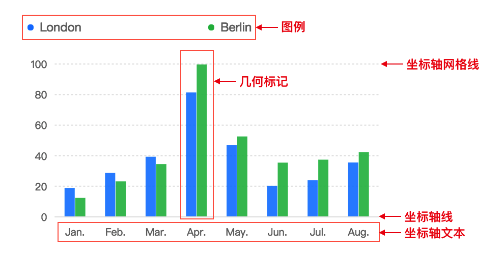
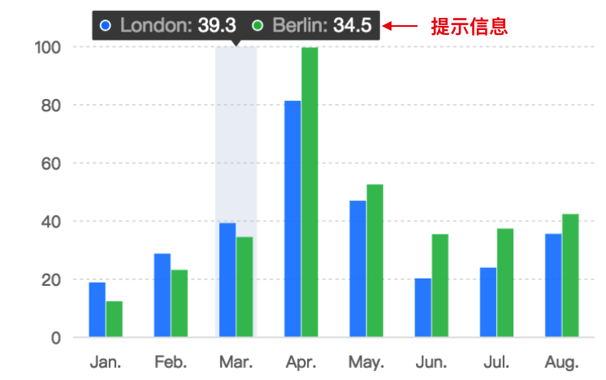
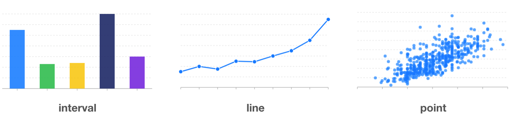
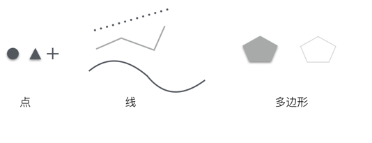

# 图表组成

为了更好得使用 F2 进行数据可视化，我们需要了解 F2 图表的组成以及相关术语。


## 图表部件


一般情况下，F2 的图表包含坐标轴（Axis）、几何标记（Geometry）、提示信息（Tooltip）、图例（Legend）等，另外还可以包括辅助标记（Guide）、数据标签（dataLabels）等。


F2 基本组成部分如下图所示：


 


## 术语

| **术语** | **英文**   | **描述**                                                     |
| -------- | ---------- | ------------------------------------------------------------ |
| 坐标轴   | Axis       | 每个图表通常包含两个坐标轴，在直角坐标系（笛卡尔坐标系）下，分别为 x 轴和 y 轴，在极坐标轴下，则分别由角度和半径 2 个维度构成。每个坐标轴由坐标轴线（line）、刻度线（tickLine）、刻度文本（label）以及网格线（grid）组成。 |
| 图例     | Legend     | 图例作为图表的辅助元素，用于标定不同的数据类型以及数据的范围，用于辅助阅读图表以及帮助用户在图表中进行数据的筛选过滤。 |
| 几何标记 | Geometry   | 即我们所说的点、线、面这些几何图形，在图形语法 中几何标记的类型决定了生成图表的类型。也就是数据被可视化后的实际表现，不同的几何标记都包含对应的图形属性。 |
| 图形属性 | Attribute  | 图形属性对应视觉编码中的视觉通道，是图形语法元素非常重要和灵活的一部分，不同的几何标记拥有自己的图形属性，F2 提供了位置（position）、颜色（color）、大小（size）、形状（shape）这四种图形属性。 |
| 坐标系   | Coordinate | 坐标系是将两种位置标度结合在一起组成的 2 维定位系统，描述了数据是如何映射到图形所在的平面。 |
| 提示信息 | Tooltip    | 当鼠标悬停在某个点上时，会以提示框的形式显示当前点对应的数据的信息，比如该点的值，数据单位等，帮助用户从图表中获取具体的数据信息。 |
| 辅助标记 | Guide      | 当需要在图表上绘制一些辅助线、辅助框或者文本时，比如增加预警线、最高值线或者标示明显的范围区域时，辅助标记 Guide 是非常有用的工具。 |


# 几何标记

几何标记即我们所说的点、线、面这些几何图形。F2 中并没有特定的图表类型（柱状图、散点图、折线图等）的概念，但是通过图形语法用户可以单独绘制某一种类型的图表，如饼图，也可以绘制混合图表，比如折线图和柱状图的组合。


F2 生成的图表的类型，都是由几何标记决定的。可以通过下图直观得理解什么是几何标记：





## 如何声明几何标记


创建好 chart 对象之后，就可以通过如下方式选择几何标记的类型：


```
const geom = chart.point(); // 这里使用了 point 类型的 geom，该方法会返回 geom 对象
```

## 几何标记类型


目前 F2 支持的几何标记的类型如下：

| **类型** | **描述**                                                     |
| -------- | ------------------------------------------------------------ |
| point    | 点，用于绘制点图、气泡图。                                   |
| path     | 路径，无序的点连接而成的一条线，常用于路径图的绘制。         |
| line     | 线，点按照 x 轴连接成一条线，构成线图。                      |
| area     | 填充线图跟坐标系之间构成区域图，也可以指定上下范围。         |
| interval | 使用矩形或者弧形，用面积来表示大小关系的图形，一般构成柱状图、饼图等图表。 |
| polygon  | 多边形，可以用于构建色块图、地图等图表类型。                 |
| schema   | 自定义图形，用于构建箱型图（或者称箱须图）、蜡烛图（或者称 K 线图、股票图）等图表。 |

## 几何标记和图表类型


虽然 F2 没有特定的图表类型概念，**但是仍支持所有传统图表类型的绘制**。


下表展示了 F2 中的 geom 几何标记类型和传统图表的对应关系，更多的图表详见[demos](https://antv.alipay.com/zh-cn/f2/3.x/demo/index.html)。

| **geom 类型** | **图表类型**                                                 | **备注**                                                     |
| ------------- | ------------------------------------------------------------ | ------------------------------------------------------------ |
| point         | 点图、气泡图、散点图                                         | 点的形状有很多，同时点也可以在不同坐标系下显示，所以还可以扩展出非常多的图表类型。 |
| path          | 路径图                                                       | 路径图是无序的线图。                                         |
| line          | 折线图、曲线图                                               | 在极坐标系下可以转换成雷达图。                               |
| area          | 区域图（面积图）、层叠区域图、百分比层叠区域图、区间区域图   | 极坐标系下可用于绘制雷达区域图。                             |
| interval      | 柱状图、分组柱状图、瀑布图、层叠柱状图、百分比层叠柱状图、直方图、南丁格尔玫瑰图、饼图、条形环图（玉缺图）、漏斗图等 | 通过坐标系的转置、变化，可以生成各种常见的图表类型；所有的图表都可以进行层叠、分组。 |
| polygon       | 色块图、地图                                                 | 多个点可以构成多边形。                                       |
| schema        | k 线图                                                       | 自定义的图表类型。                                           |

## 几何标记和图形形状（shape）


使用几何标记实现各种图表类型时，对于每一种几何标记来说，在绘制的时候还可以变换出不同的形状，视觉通道跟图形属性的映射方式不一样也会生成不同的图形：


- 点图，可以使用圆点、三角形、正方形、十字符号甚至图片表示点

- 线图，可以有折线、曲线、点线等

- 多边形，可以是实心的多边形，也可以是空心的仅有边框的多边形





下面提供了 F2 中各个 geom 内置提供的 shape 类型，在后续图形属性章节，会详细介绍 shape 的使用方法。

| **geom 类型** | **shape 类型**                   | **解释**                    |
| ------------- | -------------------------------- | --------------------------- |
| point         | 'circle', 'hollowCircle', 'rect' | 默认为 'circle'             |
| line          | 'line', 'smooth', 'dash'         | dash：虚线，smooth： 平滑线 |
| area          | 'area', 'smooth'                 | 填充内容的区域图            |
| interval      | 'rect'                           |                             |
| polygon       | 'polygon'                        |                             |
| schema        | 'candle'                         | 目前仅 K 线图               |


如果上面各种几何标记的图形形状没法满足您的需求的话，您还可以使用[自定义 shape](https://www.yuque.com/antv/f2/api-shape)功能定制更个性化的 Shape。


# 图形属性

图形属性对应视觉编码中的视觉通道，是图形语法元素中非常重要和灵活的一部分，每种几何标记都拥有自己的图形属性。F2 中支持的图形属性有下面几种：


1. **position**：位置，二维坐标系内映射至 x 轴、y 轴；

1. **color**：颜色，包含了色调、饱和度和亮度；

1. **size**：大小，不同的几何标记对大小的定义有差异；

1. **shape**：形状，几何标记的形状决定了某个具体图表类型的表现形式，例如点图，可以使用圆点、三角形、图片表示；线图可以有折线、曲线、点线等表现形式；

## 如何使用


首先需要明确一点：**图形属性是属于每一个几何标记 geom（Geometry) 的**，所以我们先要声明几何标记，然后再在该几何标记对象上进行图形属性的映射，代码如下：


```
chart.<geomType>().<attrType>(fields[, callback]);
```


其中：


- geomType，几何标记类型，具体支持的类型请阅读[几何标记](https://www.yuque.com/antv/f2/geometry)章节；

- attrType，图形属性类型，对应视觉通道；

- fields，参与单个视觉通道映射的字段，可以是单个字段也可以是多个字段，多个字段使用 `*`分割

- callback，回调函数，用于定义如何解析视觉通道，如不提供则只用 F2 默认提供的视觉通道解析方式。


除了 `attr(fields[, callback])` 的函数原型外，F2 为了用户使用的便利性，结合各个视觉通道的特点，还提供了更为便捷的使用方式，在本章后面会进行详细的介绍。


语法示例：


```
chart.point().position('a*b').color('c');

chart.interval().position('a*b').color('c', (cValue) => {
  if (cvalue === 'fail') {
    return 'red';
  }
  return 'green';
});
```


F2 对于每个图形属性的参数 `fields` 的解析规则如下：


- 如果是单个单词，如 `color('a')` 会判断该属性是否是输入数据源的字段属性，如果不是则会将其解析为一个常量；

- 如果是多个属性的映射，需要使用 `*` 进行连接，F2 会依次对这些字段进行解析和映射，如 `position('cut*price')`；

## position 位置属性


position 位置属性的映射，用于确定由数据中的哪几个字段来确定数据在平面坐标系的位置。通俗地解释，即确定 x 轴和 y 轴的数据字段。


以下面的语句为例，在 position 属性上，映射了两个属性： 'cut' 和 'price'，分别表示将 'cut' 数据值映射至 x 轴坐标点，'price' 数据值映射至 y 轴坐标点。


```
chart.point().position('cut*price');
```