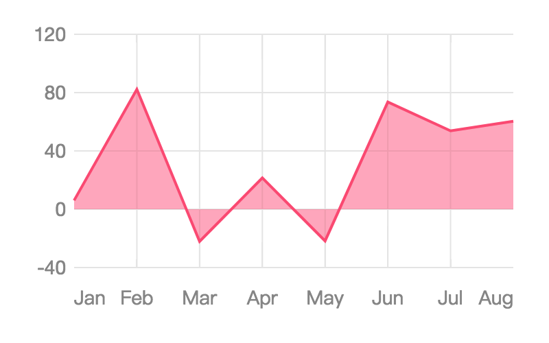
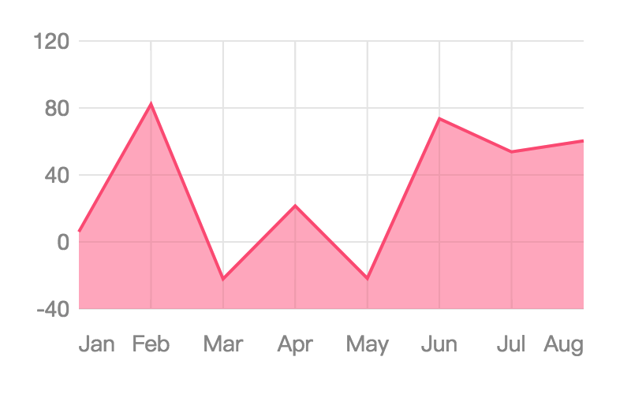

## **Geometry**

几何标记对象，决定了图表的类型，具体的概念介绍请参见 [Geom](https://www.yuque.com/antv/f2/geometry)。


语法示例：


```
chart.<geomType>()
  .position()
  .size()
  .color()
  .shape()
  .adjust()
  .style()
  .animate();
```


下面是一条简单的绘制柱状图的语法，声明完使用的 geom 类型之后，就可以进行图形上的各种图形属性映射，下面我们会进行详述。


```
chart.interval().position('x*y').color('x');
```


注意：上述 `chart.interval()` 返回的不是 chart 对象，而是一个 geom 几何标记对象 Geom。


以下是目前 Geom 的基本类型：

| **geom 类型** | **说明**                                                     |
| ------------- | ------------------------------------------------------------ |
| `point`       | 点，用于点图的构建。                                         |
| `path`        | 路径，无序的点连接而成的一条线。                             |
| `line`        | 线，点按照 x 轴连接成一条线，构成线图。                      |
| `area`        | 填充线图跟坐标系之间构成区域图，也可以指定上下范围。         |
| `interval`    | 使用矩形或者弧形，用面积来表示大小关系的图形，一般构成柱状图、饼图等图表。 |
| `polygon`     | 多边形，可以用于构建热力图、地图等图表类型。                 |
| `schema`      | k 线图，箱型图。                                             |


Geom 支持的接口可以分为三大类：


1. 数据映射相关的属性函数：`position`, `color`, `shape`, `size`；

1. 显示辅助信息的函数：`style`；

1. 额外的控制函数：`adjust`；

1. 动画配置函数：`animate`


## 属性


```
chart.<geomType>({
  generatePoints: {Boolean},
  sortable: {Boolean},
  startOnZero: {Boolean},
  connectNulls: {Boolean}
})
```


### `generatePoints`


- 参数类型：Boolean

- 描述：是否生成多个点来绘制图形，true 时会生成多个点

- 默认值：line、path 默认为 false，其他 geom 类型均为 true


```
chart.line({
  generatePoints: true
})
```


### `sortable`


- 参数类型：Boolean

- 描述：是否对数据按照 x 轴对应字段进行排序，true 时会进行排序

- 默认值：默认 area 和 line 类型会进行排序（即值为 true），其他类型均为 false。


**在绘制折线图或者区域图时，如果您的数据已经经过排序，可以将该属性设置为** **`false`****，以提高性能。**


```
chart.line({
  sortable: false
})
```


### `startOnZero`


- 参数类型：Boolean

- 描述：用于设置图形的 Y 轴基线是否从 0 开始，默认为 true，以 0 为基线

- 默认值：true


```
chart.area({
  startOnZero: false
})
```


该属性的使用场景如下：

| `startOnZero: true`                                 | `startOnZero: false`                                |
| --------------------------------------------------- | --------------------------------------------------- |
|  |  |


### `connectNulls`


- 参数类型：Boolean

- 描述：用于设置是否将空数据连接起来（用于 line，area 以及 path 类型）

- 默认值： false


```
chart.line({
  connectNulls: true // 将空数据连接
});
```


详见 [demo](https://antv.alipay.com/zh-cn/f2/3.x/demo/line/connect-null.html)。


## 方法


### position


将数据值映射到图形的位置上的方法。


```
chart.line().position('x*y');
chart.line().position([ 'x', 'y' ]);
```


#### position('fieldA*fieldB')


使用 `*` 连接，position 属性会对多个字段进行数据的映射，如：`cut*price`，`x*y` 等，用于二维坐标系图表的绘制。


以 `chart.point().position('x*y')` 为例，point 代表图形，即最后需要生成点图，而 position 代表位置，position('x*y') 代表数据在图形中的位置由 x 和 y 这两个维度的变量决定。


另外，也可以以数组格式传入：`chart.geom().position([ 'fieldA', 'fieldB' ])`


### color


将数据值映射到图形的颜色上的方法。


```
chart.line().color('red'); // 常量颜色
chart.line().color('type'); // 对 type 字段进行映射，使用内置的颜色
chart.line().color('type', [ 'red', 'blue' ]) // 指定颜色
chart.line().color('type', (type) => { // 通过回调函数
  if (type === 'a') {
    return 'red';
  }
  return 'blue';
});
chart.line().color('type*value', (type, value) => { //多个参数，通过回调函数
  if (type === 'a' && value > 100) {
    return 'red';
  }
  return 'blue';
});
```


#### color(value)


##### 参数


- `value`: String

  

  只支持接收一个参数，value 可以是：

  

- - 映射至颜色属性的数据源字段名，如果数据源中不存在这个字段名的话，则按照常量进行解析，这个时候会使用 F2 默认提供的颜色。

- - 也可以直接指定某一个具体的颜色值 color，如 '#fff', 'white', 'l(0) 0:#ffffff 0.5:#7ec2f3 1:#1890ff' 等。


##### 代码示例


```
chart.point().position('x*y').color('x'); // 对 x 字段进行映射，使用内置的颜色
chart.point().position('x*y').color('red'); // 所有点用红色渲染
chart.point().position('x*y').color('l(0) 0:#ffffff 0.5:#7ec2f3 1:#1890ff'); // 定义渐变色
```


具体的渐变色使用规则，详见 [渐变色使用](https://www.yuque.com/antv/f2/canvas#zrhdmb)。


#### color(field, colors)


##### 参数


- `field`: String

  

  field 为映射至颜色属性的数据源字段名，也支持指定多个参数。

- `colors`: String/Array/Function

  

  colors 的参数有以下情况：

  

- - 如果为空，即未指定颜色的数组，那么使用内置的全局的颜色；

- - 如果需要指定颜色，则需要以数组格式传入，那么分类的颜色按照数组中的颜色确定。对于颜色的分配顺序，会默认按照原始数据源中字段的顺序进行分配；

- - 还支持渐变颜色设置：'color1-color2'，用于指定一个渐变色，数据根据分类或者连续类型，在渐变的颜色区间内取颜色。**目前只支持 'red'、'#ddd'、'#dddddd'、'rgb(255, 10, 30)'** 这几种格式。


```
chart.point().position('x*y').color('z'); // 使用默认的颜色
chart.point().position('x*y').color('z', [ 'red', 'blue' ]); // 使用传入的指定颜色
chart.point().position('x*y').color('z', 'red-blue'); // 使用渐变色
```


- - colors 如果是回调函数，则该回调函数的参数为对应字段的数值，具体使用如下，当 color 映射为多个字段时，参数按照字段声明的顺序传入：


```
chart.point().position('x*y').color('z', (value) => {
  if(value === 1) {
    return 'red'
  }

  return 'blue';
});
```


### shape


将数据值映射到图形的形状上的方法。


```
chart.point().shape('circle'); // 常量
chart.point().shape('type'); // 使用字段映射到形状，使用内置的形状
chart.point().shape('type', [ 'circle', 'hollowCircle', 'rect' ]); // 指定形状
chart.point().shape('type', type => { // 回调函数
  if(type === 'a') {
    return 'circle';
  }
  return 'rect';
});
```


#### shape(shape)


##### 参数


- `shape`: String


只支持接收一个参数，指定几何图像对象绘制的形状。下表列出了不同的 geom 几何图形对象支持的 shape 形状：

| **geom 类型** | **shape 类型**                   | **解释**                    |
| ------------- | -------------------------------- | --------------------------- |
| point         | 'circle', 'hollowCircle', 'rect' | 默认为 'circle'             |
| line          | 'line', 'smooth', 'dash'         | dash：虚线，smooth： 平滑线 |
| area          | 'area', 'smooth'                 | 填充内容的区域图            |
| interval      | 'rect'                           |                             |
| polygon       | 'polygon'                        |                             |
| schema        | 'candle'                         | 目前仅 K 线图               |


##### 代码示例


```
chart.point().position('x*y').shape('rect'); // 指定所有点的图形是正方形
```


#### shape(field, shapes)


指定多个图形，图形的顺序跟字段的值对应。


##### 参数


- `field`: String

  

  field 为映射至颜色属性的数据源字段名。

- `shapes`: String/Array

  

  shapes 是一个可选参数，如果没有声明会按照 F2 默认为特定 geom 类型配置的形状进行渲染，当然用户也可自己指定渲染的形状，具体的形状已在上面列出，下面是 F2 为特定的几何图形对象提供的 shapes:

  

  ```
  const shapes = {
    line: [ 'line', 'dash' ],
    point: [ 'circle', 'hollowCircle' ]
  };
  ```


#### shape(field, callback)


通过回调函数设置图形类型.


##### 参数


- `field`: String

  

  field 为映射至颜色属性的数据源字段名。

- `callback`: Function

  

  [Function] 回调函数


##### 代码示例


```
chart.point().position('x*y').shape('z', value => {
  if (value === 1) {
    return 'circle'
  }
  return 'rect';
});
```


### size


将数据值映射到图形的大小上的方法。


```
chart.point.size(10); // 常量
chart.point.size('type'); // 使用字段映射到大小
chart.point.size('type', [ 0, 10 ]); // 使用字段映射到大小，并指定最大值和最小值
chart.point.size('type', type => { // 回调函数
  if (type === 'a') {
    return 10;
  }
  return 5;
});
```


#### size(value）


传入数字常量，如 `chart.point().size(20)`。


**注意：** 不同图形的 size 的含义有所差别：


- point 图形的 size 影响点的半径大小；

- line, area, path 中的 size 影响线的粗细；

- interval 的 size 影响柱状图的宽度。


#### size(field)


根据 field 字段的值映射大小。


##### 代码示例


```
chart.point().position('x*y').size('z'); // 使用 z 字段的值来映射大小
```


#### size(field, [min, max])


根据 field 字段的值映射大小，使用声明的最大值 max（默认 10） 和最小值 min（默认 1）。


##### 代码示例


```
chart.point().position('x*y').size('z', [ 10, 100 ]); // 使用 z 字段的值来映射大小，最大值为 100，最小值 10
```


#### size(field, callback)


使用回调函数控制图形大小。


##### 参数


- `callback`: Function


回调函数。


##### 代码示例


```
chart.point().position('x*y').size('z', value => {
  if (value === 1) {
    return 5;
  }
  return 10;
});
```


### adjust


声明几何标记对象的数据调整方式，可用于绘制层叠图、分组图等。支持单一的数据调整方式也支持各种数据调整方式的组合。


F2 支持的调整类型包括：'stack', 'dodge'。


```
chart.interval().adjust('stack');
chart.interval().adjust({
  type: 'stack'
});
chart.interval().adjust([{
  type: 'dodge',
  marginRatio: 0, // 数值范围为 0 至 1，用于调整分组中各个柱子的间距
}]);
```


### style


用于配置几何标记显示的图形属性，详见[绘图属性](https://www.yuque.com/antv/f2/canvas)。


有以下两种使用方式：


1. `style(cfg)`


参数：


- `cfg`: Object 类型，配置绘图属性，详见[绘图属性](https://www.yuque.com/antv/f2/canvas)。


```
line().style({ // 统一为所有 shape 设置固定的样式
  lineWidth: 2
});
```


1. `style(field, cfg)`  映射到字段的样式


参数：


- `field`: String 类型，映射的字段名

- `cfg`: Object 类型，配置绘图属性，**此时属性值也可以是回调函数**


```
style('city', {
  lineDash(val) {
    if (val === 'HZ') {
      return [ 2, 2 ];
    }
    return null;
  }
})
```


### animate


用于配置具体的动画。


```
point().animate(false); // 关闭动画

point().animate({
  appear: {
    animation: {String}, // 动画名
    easing: {String}, // 缓动函数名
    duration: {Number}, // 动画执行时间，单位为 ms
    delay: {Number} // 动画延迟时间，单位为 ms
  }, // 出场动画配置
  update: {
    animation: {String}, // 动画名
    easing: {String}, // 缓动函数名
    duration: {Number}, // 动画执行时间，单位为 ms
    delay: {Number} // 动画延迟时间，单位为 ms
  }, // 更新动画配置
  enter: {
    animation: {String}, // 动画名
    easing: {String}, // 缓动函数名
    duration: {Number}, // 动画执行时间，单位为 ms
    delay: {Number} // 动画延迟时间，单位为 ms
  }, // 图表发生数据变更时，新进场的元素动画配置
  leave: {
    animation: {String}, // 动画名
    easing: {String}, // 缓动函数名
    duration: {Number}, // 动画执行时间，单位为 ms
    delay: {Number} // 动画延迟时间，单位为 ms
  } // 离场动画配置
});
```


更多的动画使用，参见 [Animation](https://www.yuque.com/antv/f2/api-animate)。