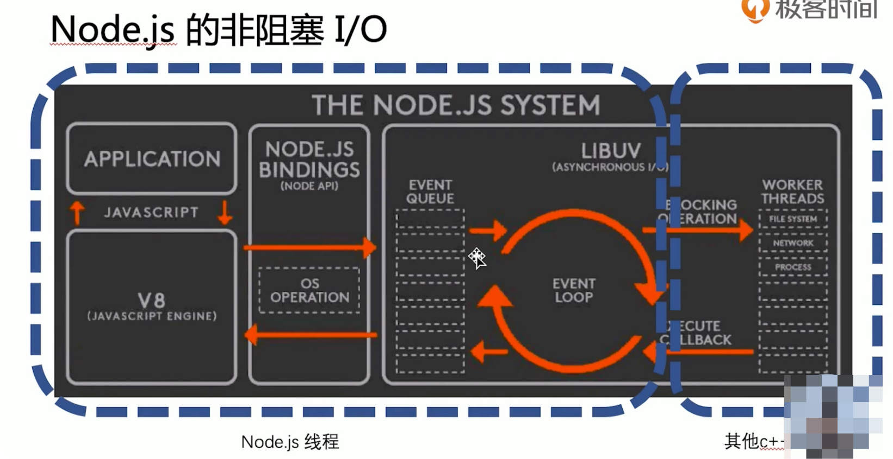

## commonjs

js通过函数创建作用域

```bash
 # 用webpack打包
 webpack --devtiik bibe --mode development --target node index.js
```


## taobao image

```bash
# 使用指定镜像 下载 cnpm
npm i -g cnpm --registry=https://registry.npm.taobao.org


```


# 13 非阻塞IO

- 阻塞IO与非阻塞IO区别：系统接收输入和输出的期间，能不能接收其他输入
- 理解非阻塞IO的要点：
  - 确定一个进行IO的系统
  - 思考IO过程中，能不能进行其他IO




# 14 异步编程 callback


- 回调函数格式规范
  - Error-first callback
  - Node-style callback
- 第一个参数是error，后面的参数才是结果

- 异步流程控制
  - 比较原始的解决方案：npm: async.js \ trunk


# 15 事件循环

- 事件循环是nodejs实现非阻塞IO的基础


# 16 promise

-  当前事件循环得不到的结果，但未来的事件循环会给你的到的结果
- 是一个状态机
  - pending
  - fulfilled/resolved
  - rejected

- then和.catch

  - resolved状态的Promise会回调第一个.then
  - rejected状态的promise会回调第一个.catch
  - 任何一个rejected 状态 且后面没有.catch的promise， 都会造成浏览器/node环境的全局错误

- 执行.then和.catch会返回一个新的promise，该promise的最终状态根据then和catch回调函数的执行结果决定

  - 回调结果为throw，该promise为rejected状态
  - 结果为return，该promise为resolved状态
  - 回调返回一个promise，结果会和返回的promise的状态保持一致

  ```js
  ;(function () {
    const promise3 = interview(1)
      .then(res => interview(2))
      .then(res => interview(3))
      .then(res => {
        console.log('smile')
      })
      .catch(err => {
        console.log('cry at round ', err.round)
      })
  
    function interview(round) {
      return new Promise((resolve, reject) => {
        setTimeout(() => {
          if (Math.random() > 0.3) {
            resolve('success')
          } else {
            const err = new Error('fail')
            err.round = round
            reject(err)
          }
        }, 500)
      })
    }
  })()
  ```


# 17 async/await

- Async/await是promise 的语法糖
- 异步编程的解决方案，使用同步方式写异步
  - await可以"暂停"async function的执行
  - await 可以以同步的写法获取promise的执行结果
  - try-catch可以捕获await所得到的错误

- async function 是一个**穿越事件循环**存在的function

- async /await同步处理并行的promise
  - 使用`await Promise.all([p1,p2])`

# 18 HTTP服务

- 应用层
- 运输层
- 网络层
- 数据链路层
- 物理层


## URL

```js
const { URL } = require('url')
const str = 'https://www.google.com:8080/a/b?x=1&y=2&y=3&y=4'

const urlObj = new URL(str)

console.log(url.parse(str))

console.log(urlObj)
console.log(urlObj.toString())

--------------------------log------------------------
Url {
  protocol: 'https:',
  slashes: true,
  auth: null,
  host: 'www.google.com:8080',
  port: '8080',
  hostname: 'www.google.com',
  hash: null,
  search: '?x=1&y=2&y=3&y=4',
  query: 'x=1&y=2&y=3&y=4',
  pathname: '/a/b',
  path: '/a/b?x=1&y=2&y=3&y=4',
  href: 'https://www.google.com:8080/a/b?x=1&y=2&y=3&y=4' }
————————————————

URL {
  href: 'https://www.google.com:8080/a/b?x=1&y=2&y=3&y=4',
  origin: 'https://www.google.com:8080',
  protocol: 'https:',
  username: '',
  password: '',
  host: 'www.google.com:8080',
  hostname: 'www.google.com',
  port: '8080',
  pathname: '/a/b',
  search: '?x=1&y=2&y=3&y=4',
  searchParams:
   URLSearchParams { 'x' => '1', 'y' => '2', 'y' => '3', 'y' => '4' },
  hash: '' }

```


23 RPC

- 不一定使用DNS作为寻址服务
- 应用层协议一般不使用HTTP
- 基于TCP或UDP


- 寻址/负载均衡
  - 使用特有服务进行寻址
- TCP通信方式
  - 单工
  - 半双工：轮番单工通信
  - 全双工
- 二进制协议
  - 更小的包体积
  - 更快的编解码速率


# 24 buffer

- buffer打印出来是一个个字节，形如<Buffer 00 00 00 00> 所以内容中的数字是16进制的

- buf.writeInt16BE(value, offset[, noAssert])  
  - BE表示高位放前面
- buf.writeInt16LE(value, offset[, noAssert])
  - LE表示低位放前面

```js

const buf2 = Buffer.from('hello x')

const buf3 = Buffer.from([1, 2, 3, 4])

const buf4 = Buffer.alloc(20)

console.log(buf2)
console.log('[1, 2, 3, 4] origin buf:')
console.log(buf3)

buf3.writeInt16BE(255, 2)
console.log('writeInt16BE 写入16位，且高位在前，在2字节处写入数字255')
console.log(buf3)

buf3.writeInt16LE(255, 2)
console.log('writeInt16BE 写入16位，且低位在前，在2字节处写入数字255')
console.log(buf3)

console.log(buf4)

=======================================
[1, 2, 3, 4] origin buf:
<Buffer 01 02 03 04>
writeInt16BE 写入16位，且高位在前，在2字节处写入数字255
<Buffer 01 02 00 ff>
writeInt16BE 写入16位，且低位在前，在2字节处写入数字255
<Buffer 01 02 ff 00>
<Buffer 00 00 00 00 00 00 00 00 00 00 00 00 00 00 00 00 00 00 00 00>
```


- protocol-buffers
- 编解码二进制

```js
const protobuf = require('protocol-buffers')
const fs = require('fs')

const msg = {
  id: 1111,
  name: 'jjjj',
  price: 80.2,
}

const messages = protobuf(fs.readFileSync(__dirname + '/test.proto', 'utf-8'))

const buf1 = messages.Column.encode(msg)
console.log(buf1)

const str1 = messages.Column.decode(buf1)
console.log(str1)

========================================
<Buffer 08 d7 08 12 04 6a 6a 6a 6a 1d 66 66 a0 42>
{ id: 1111, name: 'jjjj', price: 80.19999694824219 }
<Buffer 68 65 6c 6c 6f 20 78>
```


# 25 net模块


`net` 模块用于创建基于流的 TCP 或 [IPC](http://nodejs.cn/api/net.html#net_ipc_support) 的服务器（[`net.createServer()`](http://nodejs.cn/api/net.html#net_net_createserver_options_connectionlistener)）与客户端（[`net.createConnection()`](http://nodejs.cn/api/net.html#net_net_createconnection)）。


- 全双工的通信通道搭建
  - 关键在于应用层协议需要有标记包号的字段
  - 处理以下情况，需要有标记包长的字段
    - 粘包
    - 不完整包
  - 错误处理


27

npm i -S koa koa-mount koa-static


30 

easy_sock


# 31 RESTful 与  GraphQL

## API 服务- RESTful

• 简单易懂
• 可以快速搭建
• 在数据的聚合方面有很大劣势

## API 服务- GraphQL

• 专注数据聚合，前端要什么就返回什么

