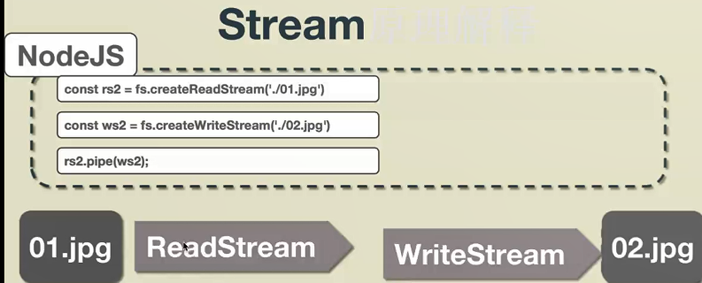

# io

异步**IO**

EventLoop是什什么
 ⼀一个循环 每次循环叫tick 每次循环的代码叫task

- V8引擎单线程⽆无法同时⼲干两件事 
- ⽂文件读取、⽹网络IO缓慢且具有不不确定性 
- 要通过异步回调⽅方式处理理⼜又称为异步IO
- 先同步再异步 异步放⼊入队列列等同步完成后在执⾏行行 每次循环叫⼀一个tick (process.nextTick())


# Buffer缓冲区

 读取数据类型为Buffer

- Buffer  ⽤用于在 TCP 流、⽂文件系统操作、以及其他上下⽂文中与⼋八位字节流进⾏行行交互。 ⼋八位字节组 成的数组，可以有效的在JS中存储⼆二进制数据

```js
//分配buffer
// 创建⼀一个⻓长度为10字节以0填充的Buffer
const buf1 = Buffer.alloc(10)
console.log('buf1,', buf1);
// 写⼊入Buffer数据
buf1.write('hello');
console.log(buf1);

//创建buffer
// 创建⼀一个Buffer包含ascii.
// ascii 查询 http://ascii.911cha.com/
const buf2 = Buffer.from('aa');
console.log('buf2', buf2, buf2.toString());


// 创建Buffer包含UTF-8字节
// UFT-8:⼀一种变⻓长的编码⽅方案，使⽤用 1~6 个字节来存储;
// UFT-32:⼀一种固定⻓长度的编码⽅方案，不不管字符编号⼤大⼩小，始终使⽤用 4 个字节来存储;
// UTF-16:介于 UTF-8 和 UTF-32 之间，使⽤用 2 个或者 4 个字节来存储，⻓长度既固定⼜又可变。
const buf3 = Buffer.from('中文');
console.log('buf3', buf3, buf3.toString());

//连接buffer
const buf4 = Buffer.concat([buf2, buf3])
console.log('buf4', buf4, buf4.toString());

```

> Buffer类似数组，所以很多数组⽅方法它都有 GBK 转码 iconv-lite


data读取到的是二进制buffer


node规定 异步方法的最后一个参数为回调函数


try catch 只能捕获同步编程中的异常


buffer

用于操作二进制流


# http

创建⼀一个http服务器器

端口：8000之后随便用，最大65535

```bash
const http = require('http')

http.createServer((request, response) => {
  console.log('there is a request')
  response.end('hello node')
})
.listen(3000)

# 当浏览器访问3000时，会发现打印了两次there is a request，这是因为有一次是favorite.ICO
```

通过查看response的原型链，可以看到他是一个流。所以上面才会像end一样的方法


# Stream流

stream - 是⽤用于与node中流数据交互的接⼝口

- readFile是将文件读入内存，会占用很大的内存空间
- stream只是拿到了stream对象，拿到两个“导管”，内存占用小



```js
 
//⼆二进制友好，图⽚片操作,06-stream.js
const fs = require('fs')
const rs2 = fs.createReadStream('./01.jpg') const ws2 = fs.createWriteStream('./02.jpg') rs2.pipe(ws2);
//响应图⽚片请求，05-http.js
const {url, method, headers} = request;
else if (method === 'GET' && headers.accept.indexOf('image/*') !== -1) { fs.createReadStream('.'+url).pipe(response);
}
```

> Accept代表发送端(客户端)希望接受的数据类型。 ⽐比如:Accept:text/xml; 代表客户端希望 接受的数据类型是xml类型。
>
> Content-Type代表发送端(客户端|服务器器)发送的实体数据的数据类型。 ⽐比如:Content- Type:text/html; 代表发送端发送的数据格式是html。
>
> ⼆二者合起来， **Accept:text/xml; Content-Type:text/html** ，即代表希望接受的数据类型是xml格 式，本次请求发送的数据的数据格式是html。


# 命令行工具

## 安装依赖

```bash
# commander 命令行
# download-git-repo 下载git仓库
# ora 进度条
# handlebars
# figlet 绘制文本
# clear 清屏
# chalk 改变终端文字颜色
# open 打开文件/目录
npm i commander download-git-repo ora handlebars figlet clear chalk open -s

```

npm init xx

创建xx/bin/

创建xx/bin/aaa.js

第一行写*#!/usr/bin/env node* ，表明使用node解析脚本，这样就可以编写js代码了

```js
#!/usr/bin/env node
console.log('cli... ss');
```


然后在package.json中添加bin属性，属性名就是命令名，值是 脚本位置

```js
{
  "name": "vue-auto-router-cli",
  "version": "1.0.0",
  "description": "",
  "main": "index.js",
  "scripts": {
    "test": "echo \"Error: no test specified\" && exit 1"
  },
  "bin": {
    "kkb": "./bin/kkb.js"
  },
  "keywords": [],
  "author": "",
  "license": "ISC"
}

```


再 npm link就可以将命令加到全局了

```bash
# 建立软链接
npm link
```


### 创建命令

Kkb.js

```js
#!/usr/bin/env node

const program = require('commander')
//-V
program.version(require('../package').version)

program
  .command('init <name>')//<name>表示参数
  .description('init project')
  .action(
    require('../lib/init')
  )

//解析参数
program.parse(process.argv)
```


### spawn函数

```js
const { promisify } = require('util')
//画笔
const figlet = promisify(require('figlet'))
const clear = require('clear')
const chalk = require('chalk');
const { clone } = require('../bin/download');
const open = require('open')

const log = content => console.log(chalk.green(content));

module.exports = async name => {
  //打印欢迎界面
  clear()
  const data = await figlet('KKB Welcome')
  log(data)
  //克隆
  await clone('github:su37josephxia/vue-template', name)

  log('安装依赖')
  await spawn('npm', ['install'], { cwd: `./${name}` })
  log(
    `
========
安装ok
========      
  `
  )

  log('打开浏览器')
  open('http://localhost:8080')

  log('运行项目')
  await spawn('npm', ['run', 'serve'], { cwd: `./${name}` })


}

function spawn(...args) {
  const { spawn } = require('child_process')
  return new Promise(resolve => {
    const proc = spawn(...args)
    //输出流连接到父进程，这样才能看到日志
    proc.stdout.pipe(process.stdout)
    proc.stderr.pipe(process.stderr)
    proc.on('close', () => {
      resolve()
    })
  })

}

```


# Koa

- 洋葱模型：职责链模式