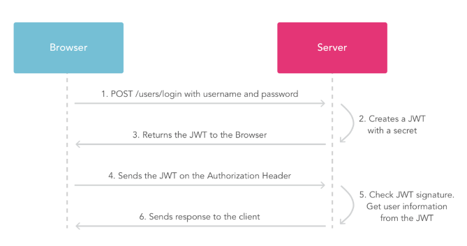
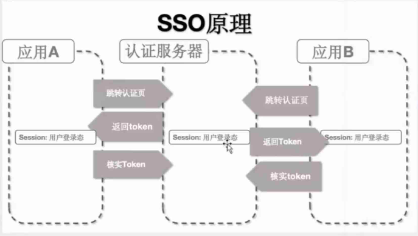

## session-cookies


### cookies

```js
const http = require("http");
http
  .createServer((req, res) => {
    if (req.url === "/favicon.ico") {
      res.end("");
      return;
    }
    // 观察cookie存在
    console.log("cookie:", req.headers.cookie);
    // 设置cookie
    res.setHeader("Set-Cookie", "cookie1=abc;");
    res.end("hello cookie!!");
  })
  .listen(3000);

```


- Header Set-Cookie负责设置cookie
- 请求传递Cookie


缺点：1、不大；2、不安全


### session-cookie

- 依赖

```bash
npm i koa-session -S
```


```js
const Koa = require("koa");
const session = require("koa-session");

const app = new Koa();

const SESSION_CONFIG = {
  key: "kkb:session",
  maxAge: 86400000, //有效期 1天
  httpOnly: true, //仅服务器修改
  signed: true, //签名cookie
};
// 签名key keys作⽤用 ⽤用来对cookie进⾏行行签名
app.keys = ["some secret"];
app.use(session(SESSION_CONFIG, app));

app.use((ctx) => {
  if (ctx.path === "/favicon.ico") return;

  let n = ctx.session.count || 0;
  ctx.session.count = ++n;
  ctx.body = `第${n}次访问`;
});

app.listen(3000, () => {
  console.log("koa listen at :3000");
});

```


哈希Hash - SHA MD5

```
- 把一个不定长摘要定长结果
- 摘要 yanglaoshi -> l3s3
- 雪崩效应：原始值变化会使摘要发生巨大变化
```


原理

> 1. 服务器器在接受客户端⾸首次访问时在服务器器端创建seesion，然后保存seesion(我们可以将seesion保存在内存中，也可以保存在redis中，推荐使⽤用后者)，然后给这个session⽣生成⼀一个唯⼀一的标识字符串串,然后在响应头中种下这个唯⼀一标识字符串串。
> 2. 签名。这⼀一步通过秘钥对sid进⾏行行签名处理理，避免客户端修改sid。（⾮非必需步骤）
> 3. 浏览器器中收到请求响应的时候会解析响应头，然后将sid保存在本地cookie中，浏览器器在下次http请求的请求头中会带上该域名下的cookie信息，
> 4. 服务器器在接受客户端请求时会去解析请求头cookie中的sid，然后根据这个sid去找服务器器端保存的该客户端的session，然后判断该请求是否合法。


## token


- ### 流程

```
1. 客户端使用户名跟密码请求登录
2. 服务端收到请求，去验证用户名与密码
3. 验证成功后，服务端会签发⼀一个令牌(Token)，再把这个 Token 发送给客户端
4. 客户端收到 Token 以后可以把它存储起来，⽐比如放在 Cookie 里或者 Local Storage里
5. 客户端每次向服务端请求资源的时候需要带着服务端签发的 Token
6. 服务端收到请求，然后去验证客户端请求里面带着的 Token，如果验证成功，就向客户端返回请求的数据
```



- 依赖

```bash
npm i jsonwebtoken koa-jwt -S 
```

- 实现

```js
const Koa = require("koa");
const jwt = require("jsonwebtoken");
const jwtAuth = require("koa-jwt");
const bodyParser = require("koa-bodyparser");
const router = require("koa-router")();
const static = require("koa-static");
const app = new Koa();
const secret = "it's a secret";

app.use(static(__dirname + "/"));
app.use(bodyParser());

router.post("/login-token", (ctx) => {
  const { body } = ctx.request;
  const userinfo = body.username;
  ctx.body = {
    message: "登陆成功！",
    user: userinfo,
    token:
      //使用jwt的签名方法
      jwt.sign(
        {
          data: userinfo,
          // 设置 token 过期时间，一小时后，秒为单位
          exp: Math.floor(Date.now() / 1000) + 60 * 60,
        },
        secret
      ),
  };
});

router.get("/getUser-token", jwtAuth({ secret }), (ctx) => {
  // 验证通过，state.user
  console.log(ctx.state.user);

  //获取session
  ctx.body = {
    message: "获取数据成功",
    userinfo: ctx.state.user.data,
  };
});

app.use(router.routes());
app.use(router.allowedMethods());
app.listen(3000);

```


> **过程回顾**
> ⽤用户登录的时候，服务端⽣生成⼀一个token返回给客户端
> 客户端后续的请求都带上这个token
> 服务端解析token获取⽤用户信息，并响应⽤用户的请求
> token会有过期时间，客户端登出的时候也会废弃token，但是服务端不不需要任何操作
>
> **与Token简单对比**
> session要求服务端存储信息，并且根据id能够检索，⽽而token不不需要（因为信息就在token
> 中，这样实现了了服务端⽆无状态化）。在⼤大规模系统中，对每个请求都检索会话信息可能是⼀一
> 个复杂和耗时的过程。但另外⼀一⽅方⾯面服务端要通过token来解析⽤用户身份也需要定义好相应
> 的协议（⽐比如JWT）。
> session⼀一般通过cookie来交互，⽽而token⽅方式更更加灵活，可以是cookie，也可以是header，
> 也可以放在请求的内容中。不不使⽤用cookie可以带来跨域上的便便利利性。
>
> token的⽣生成⽅方式更更加多样化，可以由第三⽅方模块来提供。
> token若被盗⽤用，服务端⽆无法感知，cookie信息存储在⽤用户⾃自⼰己电脑中，被盗⽤用⻛风险略略⼩小。


## JWT(JSON WEB TOKEN)原理理解析

1. Bearer Token包含三个组成部分：令牌头、payload、哈希
eyJhbGciOiJIUzI1NiIsInR5cCI6IkpXVCJ9.eyJkYXRhIjoidGVzdCIsImV4cCI6MTU2NzY5NjEzNCwiaWF0Ijo
xNTY3NjkyNTM0fQ.OzDruSCbXFokv1zFpkv22Z_9AJGCHG5fT_WnEaf72EA
base64 可逆

1. 签名：默认使用base64对payload编码，使用hs256算法对令牌头、payload和密钥进行签名生成
哈希
2. 验证：默认使用hs256算法对hs256算法对令牌中数据签名并将结果和令牌中哈希比对

```js
const jsonwebtoken = require("jsonwebtoken");
const secret = "12345567";
const opt = {
  //加密类型
  secret: "jwt_secret",
  key: "234324",
};

const user = {
  username: "xxx",
  password: "123",
};

const token = jsonwebtoken.sign(
  {
    data: user,
    exp: Math.floor(Date.now() / 1000) + 60 * 60,
  },
  secret
);

console.log("生成的token:", token);
console.log("解码:", jsonwebtoken.verify(token, secret, opt));

```


> HMAC SHA256 HMAC(Hash Message Authentication Code，散列列消息鉴别码，基于密钥的
> Hash算法的认证协议。消息鉴别码实现鉴别的原理理是，⽤用公开函数和密钥产⽣生⼀一个固定⻓长度的值
> 作为认证标识，⽤用这个标识鉴别消息的完整性。使⽤用⼀一个密钥⽣生成⼀一个固定⼤大⼩小的⼩小数据块，即
> MAC，并将其加⼊入到消息中，然后传输。接收⽅方利利⽤用与发送⽅方共享的密钥进⾏行行鉴别认证等。
> BASE64 按照RFC2045的定义，Base64被定义为：Base64内容传送编码被设计⽤用来把任意序列列的
> 8位字节描述为⼀一种不不易易被⼈人直接识别的形式。（The Base64 Content-Transfer-Encoding is
> designed to represent arbitrary sequences of octets in a form that need not be humanly
> readable.） 常⻅见于邮件、http加密，截取http信息，你就会发现登录操作的⽤用户名、密码字段通
> 过BASE64编码的
> Beare
> Beare作为⼀一种认证类型(基于OAuth 2.0)，使⽤用"Bearer"关键词进⾏行行定义
> 参考⽂文档：
> [jsonwebtoken](https://www.npmjs.com/package/jsonwebtoken)、[koa-jwt](https://www.npmjs.com/package/koa-jwt)
> 阮阮⼀一峰 JWT解释
> http://www.ruanyifeng.com/blog/2018/07/json_web_token-tutorial.html


## SSO



原理：认证服务器通过Set-Cookie 将token写在浏览器，应用登录时使用该cookie

### 认证系统

```js
/**
 * 认证逻辑
 */

"use strict";

const express = require("express");
const service = require("../service");
const router = express.Router();

//主页
router.get("/", function (req, res, next) {
  let cookies = req.cookies;
  let token = cookies.token;

  if (token && service.isTokenValid(token)) {
    let redirectUrl = req.query.redirectUrl;
    //已登录过，跳转回应用
    if (redirectUrl) {
      res.redirect(`http://${redirectUrl}?token=${token}`);
    } else {
      // TODO 如果不含有重定向页面，可以返回系统首页。这里直接返回一个登录成功的信息。
      res.send("<h1>登录成功!</h1>");
    }
  } else {
    //渲染登录页
    res.render("login");
  }
});


//登录请求
router.post("/", function (req, res, next) {
  let body = req.body;
  let name = body.name;
  let password = body.password;

  // FIXME 密码验证
  if (name === "test" && password === "123456") {
    let token = "passport";
    //设置cookie，下次认证的时候就可以直接用这个cookie
    res.cookie("token", token, {
      maxAge: 1000 * 60 * 60 * 24 * 30,
      httpOnly: true,
    });

    if (req.query.redirectUrl) {
      //带上token，跳转回应用
      res.redirect(`http://${req.query.redirectUrl}?token=${token}`);
    } else {
      res.send("<h1>登录成功!</h1>");
    }
  } else {
    res.send({
      error: 1,
      msg: "用户名或密码错误",
    });
  }
});

module.exports = router;

```


### 应用系统

```js
"use strict";

const express = require("express");
const router = express.Router();
const request = require("request");

router.get("/", function (req, res, next) {
  let system = process.env.SERVER_NAME;
  let user = req.session.user;
  if (user) {
    // 如果 session 中有用户信息，则说明已经登录过，直接返回请求的资源。
    res.render("index", {
      user: user,
      system: system,
    });
  } else {
    let loginRedirectUrl = `http://localhost:8080/login?redirectUrl=${
      req.headers.host + req.originalUrl
    }`;
    let token = req.query.token;
    //不存在token
    if (!token) {
      res.redirect(loginRedirectUrl);
    }
    //存在token,说明是在认证服务器登录过的，再次检查token的 有效性
    else {
      request(
        `http://localhost:8080/check_token?token=${token}&t=${new Date().getTime()}`,
        (error, response, data) => {
          if (!error && response.statusCode === 200) {
            data = JSON.parse(data);

            if (data.error === 0) {
              const userId = data.userId;
              if (!userId) {
                res.redirect(loginRedirectUrl);
              }
              //token有效，将用户信息写入session中
              req.session.user = userId;
              res.render("index", {
                user: userId,
                system: system,
              });
            } else {
              res.redirect(loginRedirectUrl);
            }
          } else {
            res.redirect(loginRedirectUrl);
          }
        }
      );
    }
  }
});

module.exports = router;

```

