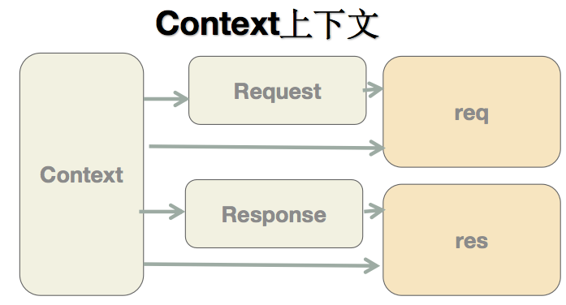

责任链模式

## context

koa为了了能够简化API，引⼊入上下⽂文context概念，将原始请求对象req和响应对象res封装并挂载到
context上，并且在context上设置getter和setter，从⽽而简化操作。
使⽤用⽅方法，接近koa了了
知识储备：getter/setter⽅方法
// app.js
app.use(ctx=>{
ctx.body = 'hehe'
})

