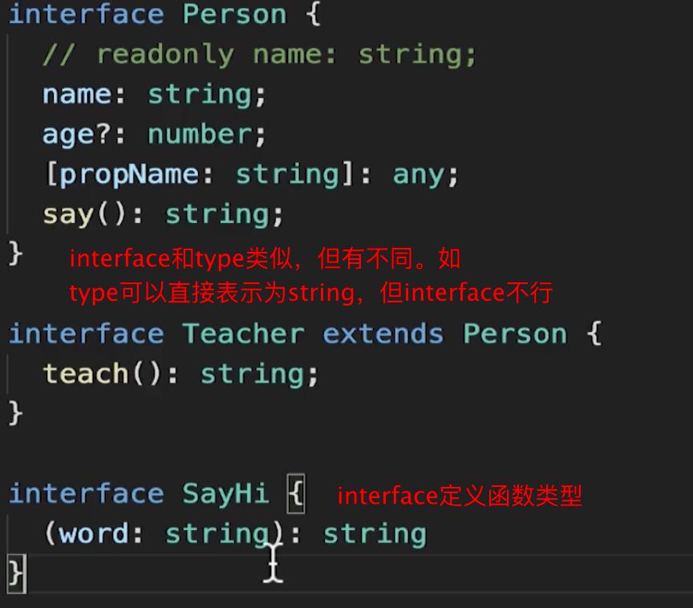
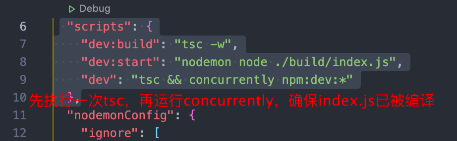

## 搭建

```bash
npm i -g typescript
# node直接运行ts
npm i -g ts-node
```


## 静态类型

函数类型

```ts

const func = (str:string):number => {
  return parseInt(str, 1);
}
//--equals
const func = (str:string):number => {
  return parseInt(str, 1);
}

const func1 :(str:string) => number = (str)=>{
  return parseInt(str,1);
}
```

## 类型注解、类型推断

Type annotation 定义变量的类型

type inference TS自动推断变量 的类型

## 函数相关类型

Never 永远不可能执行到

Void 无返回值


## 初始化ts项目

```tsx
# 会自动生成ts.config文件
tsc --init
```

### interface 与 type



# 爬虫

## 搭建

-  安装superagent：在node环境下发送ajax请求
- 安装翻译文件，因为ts不能直接读懂js模块，需要一个翻译文件

命令

```bash
# 初始化npm项目
npm init -y

# 初始化ts项目
tsc --init

# 在代码发生变化的时候自动编译
tsc -w


```


```json
 "scripts": {
    "dev": "ts-node ./src/crowller.ts",
   //监听ts文件的变化，自动编译出js文件
    "build": "tsc -w",
   //监听js文件的变化，自动执行node crowller.js
   //nodemon 默认不会监控ts文件的变化，可以通过配置修改
    "start": "nodemon node ./build/crowller.js"
  },
  "nodemonConfig": {
    "ignore": [
      "data/*"
    ]
  },
```


插件

- npm i -D concurrently

```json
"scripts": {
    "dev:build": "tsc -w",
    "dev:start": "nodemon node ./build/crowller.js",
    "dev": "concurrently npm run dev:build & npm run dev:start",
  //equals
   "dev": "concurrently npm:dev:*"
  },
```


# tsconfig.json

```bash
# 并不会使用tsconfig.json的配置
tsc xx.ts

# 直接执行tsc则会自动使用tsconfig，默认编译目录下所有的ts文件，可通过file\include\exclude 配置那些需要编译的文件
tsc

# tsnode会自动使用config 
tsnode xx.ts
```

### 配置项

```json
"removeComments":true //移除注释
"strict":true,//默认打开所有的 type-checking选项
"noImplicitAny":false,//不明显的any检查：关闭
"strictNummChecks":false,//严格的null检查：关闭
```


# cp4

## 枚举类型

```tsx
enum Status {
  ONLINE,
  OFFLINE,
  DELETED
}
//可以反查
console.log(Status.ONLINE, Status[0]);//0 ONLINE
```


### 命名空间

```tsx
/// <reference path='./components.ts'/>
//说明当前代码引用但命名空间

//home.ts
namespace Home {
  export class Page {
    constructor() {
      new Components.Header();
      new Components.Content();
      new Components.Footer();
    }
  }
}
  
//comp.ts
  namespace Components {
  //子命名空间
  export namespace SubNs {
    export class Test {}
  }

  export class Header {
    constructor() {
      let ele = document.createElement("div");
      ele.innerText = "header";
      document.body.appendChild(ele);
    }
  }
  export class Content {
    constructor() {
      let ele = document.createElement("div");
      ele.innerText = "Content";
      document.body.appendChild(ele);
    }
  }
  export class Footer {
    constructor() {
      let ele = document.createElement("div");
      ele.innerText = "Footer";
      document.body.appendChild(ele);
    }
  }
}

//将多个代码打包到同一文件需要用amd的模块规范
//同时在outFile声明输出的文件    
```


# c p5




```bash
# 使用experss中间件
npm i -s body-parser


```


### 类型拓展

- 当引入的库的类型定义文件.d.ts文件类型描述不准确时，可以通过继承原有类型，再改写的方式，修正

```tsx
//例如express
interface RequestWithBody extends Request {
  body: {
    [key: string]: string | undefined;
  };
}

///---

router.post("/getData", (req: RequestWithBody, res: Response) => {
  const { password } = req.body;
  if (password !== "123") {
    return res.send("password Error!");
  }
```


### 类型糅合

- 使用中间件的时候，对req或res修改之后，实际上的类型并不能改变

```
在目录下定义一个x.d.ts文件，
仿造类型描述文件，声明命名空间

//类型糅合
declare namespace Express {
  interface Request {
    teacherName: string;
  }
}

```


### 登陆

- 使用cookie-session做持久化

```basg
npm i -s cookie-session
```


