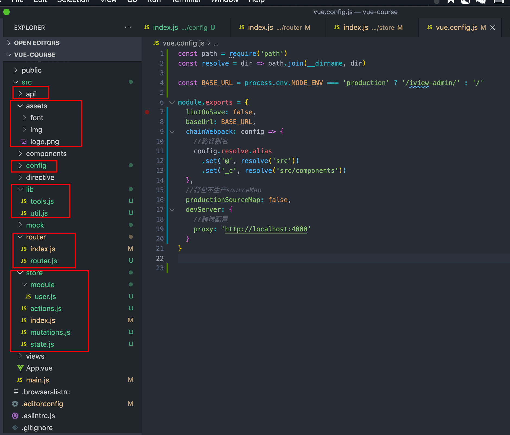
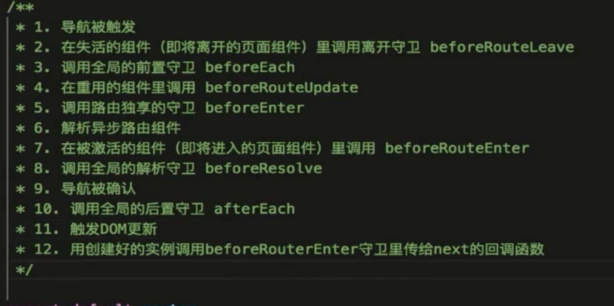

# 搭建

```bash
# 打开vue cli 界面
vue ui
```

## 基础目录结构




### vue.config.js

```js
const path = require('path')
const resolve = dir => path.join(__dirname, dir)

const BASE_URL = process.env.NODE_ENV === 'production' ? '/iview-admin/' : '/'

module.exports = {
  lintOnSave: false,
  baseUrl: BASE_URL,
  chainWebpack: config => {
    //路径别名
    config.resolve.alias
      .set('@', resolve('src'))
      .set('_c', resolve('src/components'))
  },
  //打包不生产sourceMap
  productionSourceMap: false,
  devServer: {
    //跨域配置
    proxy: 'http://localhost:4000'
  }
}


```


# 路由


### 命名路由

```html
<template>
  <div id="app">
    <div id="nav">
      <router-link to="/">Home</router-link> |
      <router-link to="/about">About</router-link>
    </div>
    <router-view />
    <router-view name="email" />
    <router-view name="tel" />
  </div>
</template>

```

```js
//router
...
{
    path: '/named_view',
    components: {
      default: () => import('@/views/child.vue'),
      email: () => import('@/views/email'),
      tel: () => import('@/views/tel')
    }
  }
```


### 重定向

```js
 {
    path: '/main',
    redirect: to => '/',
    /*  
    redirect: '/',
    redirect: {
       name: 'Home'
     },
     */
  }
```

### alias

```js
{
    path: '/',
    alias: '/home_page',
    name: 'Home',
    component: Home
  },
```


### 参数绑定

```js
//在组件的props声明要接收的参数
export default {
  data() {
    return {};
  },
  props: {
    food: {
      type: String,
      default: "strawberry",
    },
  },
};


//1 params 
{
    path: '/argu/:name',
    name: 'argu',
    component: () => import('@/views/argu'),
    props: true
  },
  
  //2对象模式
  {
    path: '/about',
    name: 'About',
    props: {
      food: 'banana'
    },
    component: () => import(/* webpackChunkName: "about" */ '../views/About.vue')
  },
  
  //3 函数模式
   {
    path: '/',
    alias: '/home_page',
    name: 'Home',
    component: Home,
    props: route => ({
      food: route.query.food
    })
```


### mode

- history：需要后端配合
- hash（默认）

### 404

```js
  {
    path: '*',
    component: () => import('@/views/error_404')
  }
```

### 路由守卫

```js
const HAS_LOGINED = true

//前置守卫
router.beforeEach((to, from, next) => {
  if (to.name !== 'login') {
    if (HAS_LOGINED) next()
    else next({ name: 'login' })
  } else {
    if (HAS_LOGINED) next({ name: 'home' })
    else next()
  }
})

//导航被确认之前，同时在所有组件内的守卫，异步路由组件被解析后 触发，
//参数与beforeEach一样
router.beforeResolve

//后置钩子
router.afterEach((to, from) => {

  //logining =false

})
```

### 路由独享守卫

```js
{
    path: '/',
    alias: '/home_page',
    name: 'home',
    component: Home,
    props: route => ({
      food: route.query.food
    }),
    beforeEnter: (to, from, next) => {
      // if (from.name === 'about') alert('这是从about来的')
      // else alert('这不是从about来的')
      next()
    }
  },
```

### 组件内守卫

- beforeRouteEnter
- beforeRouteLeave
- beforeRouteUpdate

```js
 beforeRouteEnter(to, from, next) {
    next((vm) => {
      console.log(vm);
    });
  },
  beforeRouteLeave(to, from, next) {
    const leave = confirm("您确定要离开吗？");
    if (leave) {
      next();
    } else {
      next(false);
    }
  },
     //当前组件被复用时触发
  beforeRouteUpdate(to, from, next) {
    console.log(to.name, from.name);
  },
```

### 路由切换动画

```js
<template>
  <div id="app">
    <div id="nav">
      <router-link to="/">Home</router-link> |
      <router-link to="/about">About</router-link>
    </div>
    <transition-group :name="routerTransition">
      <router-view key="default" />
      <router-view key="email" name="email" />
      <router-view key="tel" name="tel" />
    </transition-group>
  </div>
</template>

<script>
export default {
  data() {
    return {
      routerTransition: "",
    };
  },
  watch: {
    //监听路由的变化
    $route(to) {
      to.query &&
        to.query.routerTransition &&
        (this.routerTransition = to.query.routerTransition);
    },
  },
};
</script>

<style lang="less">
.router-enter {
  opacity: 0;
}
.router-enter-active,
.router-leave-active {
  transition: opacity 1s ease;
}
.router-enter-to {
  opacity: 1;
}
.router-leave {
  opacity: 1;
}
.router-leave-to {
  opacity: 0;
}
</style>

```


## 路由解析流程

