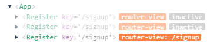

[**渡口**](https://segmentfault.com/u/dukou_5d2d29d08ed22)

-  **1**
- **新人请关照**

# [vue中怎么动态控制keep-alive缓存](https://segmentfault.com/q/1010000021632465)

[vue-router](https://segmentfault.com/t/vue-router)

开发中有一个需求 我称 A B C 三个页面 从A到B页面不需要使用keep-alive 但是从B 到C使用

从a页面跳转到b页面时 需要发请求拿到一个的数据回显, 改页面数据时需跳到c页面 当从c页面返回b页面时 会重新请求一次 这次又把我更改过的数据又给覆盖了 我现在采用的是keepalive实现的 但是这是有bug a页面有很多不一样的数据 当我跳到b页面时 应该是不同的数据 现在的话数据是不会变的 我想问一下怎样能动态控制一个页面的是否keepalive缓存

阅读 1.3k

