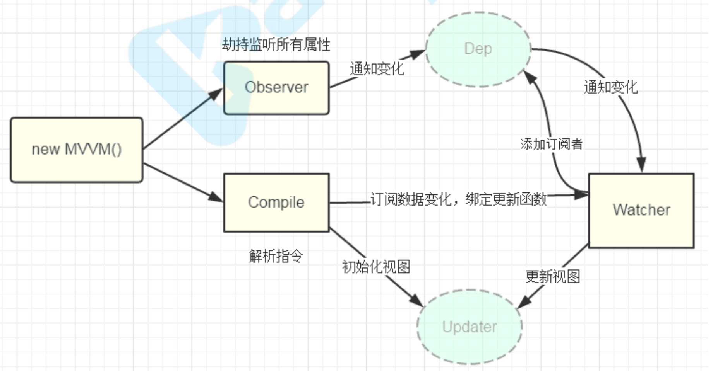

# L2

## 响应式的方式

- 使用vue实例对象的data属性

- 使用vue工具vue.util.defineReactive('propName','propVal')

## Vuex

集中式管理数据、数据变化可预测


# L3

## 原理分析

1. new Vue() 首先执行初始化，对data执行响应化处理，这个过程发生在Observer中

2. 同时对模板执行编译，找到其中动态绑定的数据，从data中获取并初始化视图，这个过程发生在

   Compile中

3. 同时定义一个更新函数和Watcher，将来对应数据变化时Watcher会调用更新函数

4. 由于data的某个key在一个视图中可能出现多次，所以每个key都需要一个管家Dep来管理多个

   Watcher

5. 将来data中数据一旦发生变化，会首先找到对应的Dep，通知所有Watcher执行更新函数

## 涉及类型介绍

KVue:框架构造函数 

Observer:执行数据响应化(分辨数据是对象还是数组) 

Compile:编译模板，初始化视图，收集依赖(更新函数、watcher创建) 

Watcher:执行更新函数(更新dom)

Dep:管理多个Watcher，批量更新




## 缺点

vue1为每个用到响应式数据的地方创建一个watcher，并将同一个key的watcher交由一个dep管理，实现了视图的更新。但是这么做就会创建很多的watcher。

在vue2中引入了虚拟dom，为每个组件创建watcher，通过diff算法更新dom


# L4

安装rollup

```bash
npm i -g rollup
```

修改dev脚本，添加sourcemap，package.json

```json
"dev": "rollup -w -c scripts/config.js --sourcemap --environment TARGET:web-full-dev"
```


引入vue.js

```html
<scrip src='../../dist/vue.js'></script>
```

> 术语解释
>
> - runtime
> - Common: cjs规范，用于webpack1
> - esm: ES模块，用于webpack2+以上
> - umd: universal module definition，兼容cjs和amd，即什么都不带的vue.js文件，用于浏览器


### src/platforms/web/entry-runtime-with-compiler.js

入口文件，覆盖$mount，执行模版解析和编译工作

### src/platforms/web/runtime/index.js

定义$mount方法

### src/core/index

定义全局api

```js
Vue.set = set
Vue.delete = del
Vue.nextTick = nextTick
initUse(Vue) // 实现Vue.use函数
initMixin(Vue) // 实现Vue.mixin函数
initExtend(Vue) // 实现Vue.extend函数
initAssetRegisters(Vue) // 注册实现Vue.component/directive/filter
```


### src/core/instance/index

定义构造函数

定义实例方法

```js
function Vue (options) { // 构造函数仅执行了_init this._init(options)
}
initMixin(Vue) // 实现init函数
stateMixin(Vue) // 状态相关api $data,$props,$set,$delete,$watch 
eventsMixin(Vue)// 事件相关api $on,$once,$off,$emit 
lifecycleMixin(Vue) // 生命周期api _update,$forceUpdate,$destroy 
renderMixin(Vue)// 渲染api _render,$nextTick
```


### src/core/instance/init.js

初始化方法_init定义的地方

```js
initLifecycle(vm) //$parent, $root, $children, $refs
initEvents(vm)  //对父组件传入的事件添加监听
initRender(vm)  //声明$slots, $createElement
callHook(vm, 'beforeCreate') //调用beforeCreate 生命周期钩子
initInjections(vm) // 注入数据 resolve injections before data/props
initState(vm) //重要：数据初始化，响应式
initProvide(vm) // 提供数据 resolve provide after data/props
callHook(vm, 'created')
```

### src/core/observer


## 初始化过程

New Vue() => this._init(options) => $mount => mountComponent() => _render() => _update()

调用init => 初始化各种属性 => 调用mountComponent =>声明updateComponent、创建Watcher => _render获取虚拟dom=> _update() 把虚拟dom转为真实dom

