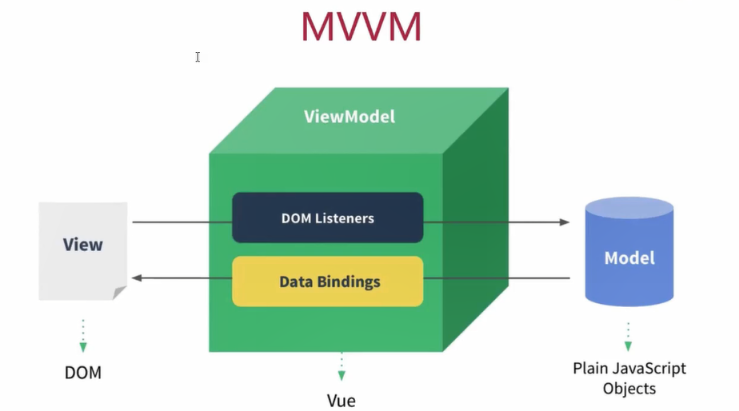

# 工具

vscode

f5调试，支持node


# vue

## 理解vue的设计思想

- 数据驱动应用
- MVVM模式的践行者



MVVM框架三要素：： 响应式、模板引擎及其渲染


## 模板和渲染函数

vue会将写好的模板转化成一个渲染函数，放在this.$options.render上


# 生命周期

关于Vue的生命周期，下列哪项是不正确的?(B)[单选题]
 A、Vue 实例从创建到销毁的过程，就是生命周期。
 B、页面首次加载会触发beforeCreate, created, beforeMount, mounted, beforeUpdate, updated。 
C、created表示完成数据观测，属性和方法的运算，初始化事件，$el属性还没有显示出来。
 D、DOM渲染在mounted中就已经完成了。

在created并没有$el，在mounted时才有

**生命周期图示**

生命周期图示、生命周期列表 结论:

三个阶段:初始化、更新、销毁 初始化:beforeCreate、created、beforeMount、mounted 更新:beforeUpdate、updated 销毁:beforeDestroy、destroyed

**使用场景分析**

```
{
beforeCreate(){} // 执行时组件实例还未创建，通常用于插件开发中执行一些初始化任务
created(){} // 组件初始化完毕，各种数据可以使用，常用于异步数据获取 beforeMounted(){} // 未执行渲染、更新，dom未创建
mounted(){} // 初始化结束，dom已创建，可用于获取访问数据和dom元素 beforeUpdate(){} // 更新前，可用于获取更新前各种状态
updated(){} // 更新后，所有状态已是最新
beforeDestroy(){} // 销毁前，可用于一些定时器或订阅的取消
destroyed(){} // 组件已销毁，作用同上
}
```


**Vue****组件化的理解** 组件化是Vue的精髓，Vue应用就是由一个个组件构成的。Vue的组件化涉及到的内容非常多，当面试时

被问到:谈一下你对Vue组件化的理解。这时候有可能无从下手，可以从以下几点进行阐述:

**定义**:组件是**可复用的** **Vue** **实例**，准确讲它们是VueComponent的实例，继承自Vue。 **优点**:从上面案例可以看出组件化可以增加代码的**复用性**、**可维护性**和**可测试性**。 **使用场景**:什么时候使用组件?以下分类可作为参考:

通用组件:实现最基本的功能，具有通用性、复用性，例如按钮组件、输入框组件、布局组件等。 业务组件:它们完成具体业务，具有一定的复用性，例如登录组件、轮播图组件。 页面组件:组织应用各部分独立内容，需要时在不同页面组件间切换，例如列表页、详情页组件

**如何使用组件**

定义:Vue.component()，components选项，sfc 分类:有状态组件，functional，abstract 通信:props，$emit()/$on()，provide/inject，$children/$parent/$root/$attrs/$listeners 内容分发:<slot>，<template>，v-slot

使用及优化:is，keep-alive，异步组件 **组件的本质**

vue中的组件经历如下过程
 组件配置 => VueComponent实例 => render() => Virtual DOM=> DOM 

所以**组件的本质是产生虚拟DOM**


<<<<<<< HEAD
# 渲染函数

render(h){}其中的h就是渲染函数

h的三个参数

1. tagname，标签名
2. data
3. 子节点VNode数组，可由h渲染生成

## 函数式组件

#### functional: true
## 组件或元素引用

ref和vm.$refs

ref 被用来给元素或子组件注册引用信息。引用信息将会注册在父组件的 $refs 对象上。如果在普通
的 DOM 元素上使用，引用指向的就是 DOM 元素；如果用在子组件上，引用就指向组件

注意：

- ref 是作为渲染结果被创建的，在初始渲染时不能访问它们
- $refs 不是响应式的，不要试图用它在模板中做数据绑定
- 当 v-for 用于元素或组件时，引用信息将是包含 DOM 节点或组件实例的数组。


## 插件

插件声明
Vue.js 的插件应该暴露一个 `install` 方法。
这个方法的第一个参数是 Vue 构造器，第二个参数是一个可选的选项对象：

```js
MyPlugin.install = function (Vue, options) {
// 1. 添加全局方法或属性
Vue.myGlobalMethod = function () {}
// 2. 添加全局资源
Vue.directive('my-directive', {})
// 3. 注入组件选项
Vue.mixin({
created: function () {
// 逻辑...
}
})
// 4. 添加实例方法
Vue.prototype.$myMethod = function (methodOptions) {}
}
```

插件使用
使用`Vue.use`即可引入插件


## vue-cli

快速原型开发 
你可以使用 `vue serve` 和 `vue build` 命令对单个 *.vue 文件进行快速原型开发。

```js
npm i -g @vue/cli-service-global
```


vue ui 命令打开图形化界面


## 安装插件

vue add xxxplugin


处理资源路径
当你在 JavaScript、CSS 或 *.vue 文件中使用相对路径 (必须以 . 开头) 引用一个静态资源时，该资源
将被webpack处理。
转换规则
如果 URL 是一个绝对路径 (例如 /images/foo.png )，它将会被保留不变。

```


```

如果 URL 以 . 开头会作为一个相对模块请求被解释并基于文件系统相对路径。

```

```

如果 URL 以 ~ 开头会作为一个模块请求被解析。这意味着你甚至可以引用 Node 模块中的资源：

```

```

如果 URL 以 @ 开头会作为一个模块请求被解析。Vue CLI 默认会设置一个指向 src 的别名 @ 。

```
import Hello from '@/components/Hello.vue'
```

**何时使用 public 文件夹**
通过 webpack 的处理并获得如下好处：
脚本和样式表会被压缩且打包在一起，从而避免额外的网络请求。
文件丢失会直接在编译时报错，而不是到了用户端才产生 404 错误。
最终生成的文件名包含了内容哈希，因此你不必担心浏览器会缓存它们的老版本。
如下情况考虑使用public文件夹
你需要在构建输出中指定一个固定的文件名字。
你有上千个图片，需要动态引用它们的路径。
有些库可能和 webpack 不兼容，除了将其用一个独立的 <script> 标签引入没有别的选择。

**使用public文件夹的注意事项**
如果你的应用没有部署在域名的根部，那么你需要为你的 URL 配置 publicPath 前缀

```json
// vue.config.js
module.exports = {
    publicPath: process.env.NODE_ENV === 'production'
        ? '/cart/'
        : '/'
}
```

在 public/index.html 等通过 html-webpack-plugin 用作模板的 HTML 文件中，你需要通过
<%= BASE_URL %> 设置链接前缀：

```
<link rel="icon" href="<%= BASE_URL %>favicon.ico">
```

在模板中，先向组件传入BASE_URL：

```


...

data () {
    return {
    	publicPath: process.env.BASE_URL
    }
}
```


## Css

自动化导入样式
自动化导入样式文件 (用于颜色、变量、mixin等)，可以使用 style-resources-loader。

配置

```
const path = require('path')
function addStyleResource(rule) {
    rule.use('style-resource')
        .loader('style-resources-loader')
        .options({
        patterns: [
        path.resolve(__dirname, './src/styles/imports.scss'),
        ],
   	 })
}
module.exports = {
    chainWebpack: config => {
    const types = ['vue-modules', 'vue', 'normal-modules', 'normal']
    types.forEach(type =>
    addStyleResource(config.module.rule('scss').oneOf(type)))
    },
}
```


**数据模拟**
使用开发服务器配置before选项，可以编写接口，提供模拟数据。

```js
devServer:{
    before(app) {
        app.get('/api/courses', (req, res) => {
            res.json([{ name: 'web全栈', price: 8999 }, { name: 'web高级', price:
            8999 }])
        })
    }
}
```

调用

```js
import axios from 'axios'
export function getCourses() {
	return axios.get('/api/courses').then(res => res.data)
}
```

代理
设置开发服务器代理选项可以有效避免调用接口时出现的跨域问题。当请求的资源不存在时，会向该代理服务器进行请求

```
devServer: {
	proxy: 'http://localhost:3000'
}
```

测试接口

```
// 需要安装express：npm i express
const express = require('express')
const app = express()
app.get('/api/courses', (req, res) => {
res.json([{ name: 'web全栈', price: 8999 }, { name: 'web高级', price: 8999 }])
})
app.listen(3000)
```

# vuex

**模块化**

使用modules定义多个子模块利于组件复杂状态

```js
import user from './user'
export default new Vuex.Store({ 
  namespaced: true, // 避免命名冲突
  modules: {
			user,
  }
})
```

访问state需要state.user.isLogin、 this.$store.dispatch('user/login', 'admin').

**严格模式**

严格模式下，无论何时发生了状态变更且不是由 mutation 函数引起的，将会抛出错误。这能保证所有 的状态变更都能被调试工具跟踪到。开启严格模式 strict: true

**插件**

Vuex 的 store 接受 plugins 选项，这个选项暴露出每次 mutation 的钩子。Vuex 插件就是一个函 数，它接收 store 作为唯一参数:

注册插件:

```js
const store = new Vuex.Store({ // ...
  plugins: [myPlugin]
})
```

实现登录状态持久化，store/plugins/persist.js

```js
export default store => {
  if(localStorage ){
    const user =  JSON.parse(localStorage.getItem('user'))
    if (user) {
      store.commit('user/login', user.username)
    }
  }

  store.subscribe((mutation, state) => {
    if(mutation.type ==='user/login') {
      localStorage.setItem('user', JSON.stringify(state.user))
    } else if(mutation.type === 'user/logout'){
      localStorage.removeItem('user')
    }
  })
}
```


# 组件化

1、组件之间的通信方式 2、内容分发（插槽）

## 组件通信

通过事件的方式：发布订阅模式，它的派发者和监听者都是同一个对象。

- 两个子组件，通过$parent通信
- $children，父组件可以直接访问子组件的实例，调用其方法。但是$children不保证顺序。（可能是异步组件）


# API

## [实例方法 / 生命周期](https://cn.vuejs.org/v2/api/#实例方法-生命周期)

### vm.$mount([[elementOrSelector\] )](https://cn.vuejs.org/v2/api/#vm-mount)

- **参数**：

  - `{Element | string} [elementOrSelector]`
  - `{boolean} [hydrating]`

- **返回值**：`vm` - 实例自身

- **用法**：

  如果 Vue 实例在实例化时没有收到 el 选项，则它处于“未挂载”状态，没有关联的 DOM 元素。可以使用 `vm.$mount()` 手动地挂载一个未挂载的实例。

  如果没有提供 `elementOrSelector` 参数，模板将被渲染为文档之外的的元素，并且你必须使用原生 DOM API 把它插入文档中。

  这个方法返回实例自身，因而可以链式调用其它实例方法。

- **示例**：

  ```js
  var MyComponent = Vue.extend({
    template: '<div>Hello!</div>'
  })
  
  // 创建并挂载到 #app (会替换 #app)
  new MyComponent().$mount('#app')
  
  // 同上
  new MyComponent({ el: '#app' })
  
  // 或者，在文档之外渲染并且随后挂载
  var component = new MyComponent().$mount()
  document.getElementById('app').appendChild(component.$el)
  ```

