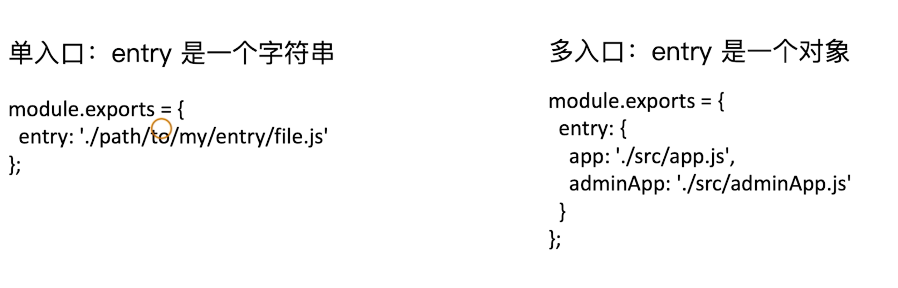
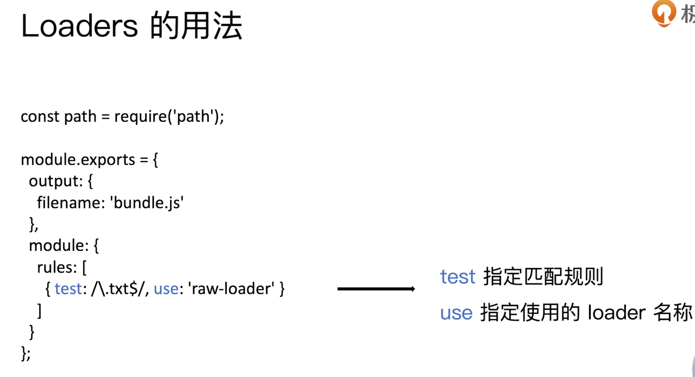
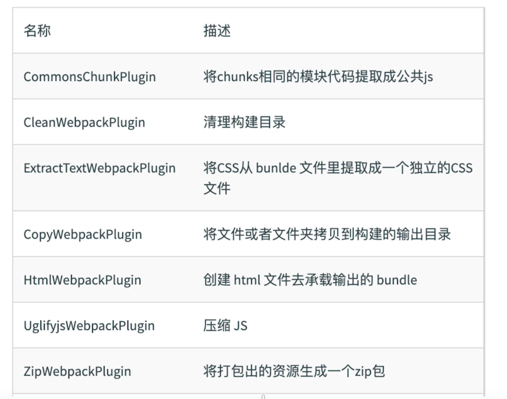
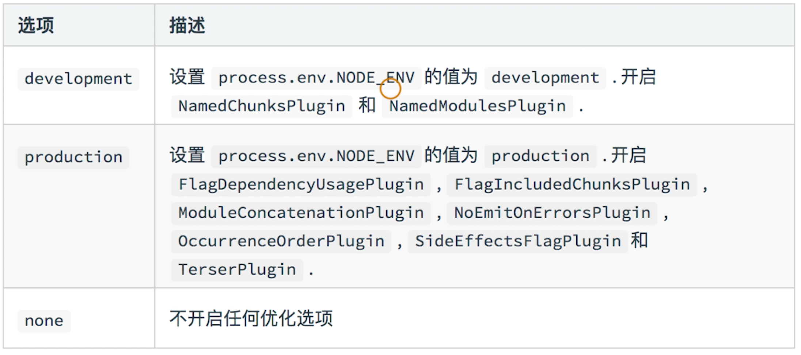

# 插件安装命令

```bash
##
npm init
#-y 的含义：yes的意思，在init的时候省去了敲回车的步骤，生成的默认的package.json
npm init -y


## npm查看全局安装过哪些包(插件)
### 第一种方法:
 	npm list -g --dept 0
### 第二种方法:(查看全局的)注意:ls是可以写成list
	npm ls 插件名字 -g // 查看全局的插件信息


##
npm -i webpack webpack-cli -g

npm -i webpack webpack-cli -D


## 运行指令
webpack ./src/index.js -o ./build/built.js --mode=development


## 安装css预处理器
npm i css-loader style-loader -D

## 安装less 预处理
npm i less-loader less -D


##安裝图片处理器
npm i url-loader file-loader -D

## html-loader处理html文件的img图片（负责引入img，从而能被url-loader进行处理）
npm i url-loader file-loader -D

## css兼容性处理  postcss-preset-env用于识别浏览器环境，从而加载制定配置
npm i postcss-loader postcss-preset-env -D


## 语法检查 eslint airbnb
npm i eslint-loader  eslint eslint-config-airbnb-base  eslint-plugin-import -D

## js兼容性处理 babel-loader @babel/core 
## 基本 @babel/preset-env
## 全部 @babel/polyfill
## 按需 core-js
npm i babel-loader @babel/core @babel/preset-env core-js -D


## 开启服务器
npm i serve -g
## 启动服务器，将build目录下所有资源作为静态资源暴露出去
serve -s build


## 下载terser，代码压缩
npm i terser-webpack-plugin -D

## 安装webpack5
npm i webpack@next webpack-cli -D
```


# webpack.config.js

作用: 指示 webpack 干哪些活（当你运行 webpack 指令时，会加载里面的配置）

所有构建工具都是基于nodejs平台运行的~模块化默认采用commonjs。

// resolve用来拼接绝对路径的方法

## webpack的五个核心概念

Entry, output, loader, plugins, mode

## 解析ES6

```bash
# -D: --saveDev 的简写
npm i @babel/core @babel/preset-env babel-loader -D
```


### 解析样式、html

- use数组中loader执行顺序：从右到左，从下到上 依次执行

```js
/*
  webpack.config.js  webpack的配置文件
    作用: 指示 webpack 干哪些活（当你运行 webpack 指令时，会加载里面的配置）

    所有构建工具都是基于nodejs平台运行的~模块化默认采用commonjs。
*/

// resolve用来拼接绝对路径的方法
const { resolve } = require('path');
const HtmlWebpackPlugin = require('html-webpack-plugin');

module.exports = {
  // webpack配置
  // 入口起点
  entry: './src/index.js',
  // 输出
  output: {
    // 输出文件名
    filename: 'built.js',
    // 输出路径
    // __dirname nodejs的变量，代表当前文件的目录绝对路径
    path: resolve(__dirname, 'build')
  },
  // loader的配置
  module: {
    rules: [
      // 详细loader配置
      // 不同文件必须配置不同loader处理
      {
        // 匹配哪些文件
        test: /\.css$/,
        // 使用哪些loader进行处理
        use: [
          // use数组中loader执行顺序：从右到左，从下到上 依次执行
          // 创建style标签，将js中的样式资源插入进行，添加到head中生效
          'style-loader',
          // 将css文件变成commonjs模块加载js中，里面内容是样式字符串
          'css-loader'
        ]
      },
      {
        test: /\.less$/,
        use: [
          'style-loader',
          'css-loader',
          // 将less文件编译成css文件
          // 需要下载 less-loader和less
          'less-loader'
        ]
      }
    ]
  },
  // plugins的配置
  plugins: [
    // plugins的配置
    // html-webpack-plugin
    // 功能：默认会创建一个空的HTML，自动引入打包输出的所有资源（JS/CSS）
    // 需求：需要有结构的HTML文件
    new HtmlWebpackPlugin({
      // 复制 './src/index.html' 文件，并自动引入打包输出的所有资源（JS/CSS）
      template: './src/index.html'
    })
  ],
  // 模式
  mode: 'development', // 开发模式
  // mode: 'production'
}

```


  loader: 1. 下载   2. 使用（配置loader）

  plugins: 1. 下载  2. 引入  3. 使用


### 打包图片文件

- 因为url-loader默认使用es6模块化解析，而html-loader引入图片是commonjs，
  为了使图片能解析，所以关闭url-loader的es6模块化，使用commonjs解析

```js
module: {
    rules: [
      {
        test: /\.less$/,
        // 要使用多个loader处理用use
        use: ['style-loader', 'css-loader', 'less-loader']
      },
      {
        // 问题：默认处理不了html中img图片
        // 处理图片资源
        test: /\.(jpg|png|gif)$/,
        // 使用一个loader
        // 下载 url-loader file-loader
        loader: 'url-loader',
        options: {
          // 图片大小小于8kb，就会被base64处理
          // 优点: 减少请求数量（减轻服务器压力）
          // 缺点：图片体积会更大（文件请求速度更慢）
          limit: 8 * 1024,
          // 问题：因为url-loader默认使用es6模块化解析，而html-loader引入图片是commonjs
          // 解析时会出问题：[object Module]
          // 解决：关闭url-loader的es6模块化，使用commonjs解析
          esModule: false,
          // 给图片进行重命名
          // [hash:10]取图片的hash的前10位
          // [ext]取文件原来扩展名
          name: '[hash:10].[ext]'
        }
      },
      {
        test: /\.html$/,
        // 处理html文件的img图片（负责引入img，从而能被url-loader进行处理）
        loader: 'html-loader'
      }
    ]
  },
```


### 打包其他资源

```js
 module: {
    rules: [
      {
        test: /\.css$/,
        use: ['style-loader', 'css-loader']
      },
      // 打包其他资源(除了html/js/css资源以外的资源)
      {
        // 排除css/js/html资源
        exclude: /\.(css|js|html|less)$/,
        loader: 'file-loader',
        options: {
          name: '[hash:10].[ext]'
        }
      }
    ]
  },
```


### 使用webpack-dev-server

- webpack-dev-server 一般不全局安装，所以使用npx 来运行

```js
 // 开发服务器 devServer：用来自动化（自动编译，自动打开浏览器，自动刷新浏览器~~）
  // 特点：只会在内存中编译打包，不会有任何输出
  // 启动devServer指令为：npx webpack-dev-server
  devServer: {
    // 项目构建后路径
    contentBase: resolve(__dirname, 'build'),
    // 启动gzip压缩
    compress: true,
    // 端口号
    port: 3000,
    // 自动打开浏览器
    open: true
  }
```


## 生产环境

### 提取css

- `mini-css-extract-plugin`  中的 `MiniCssExtractPlugin.loader`取代 `style-loader`。作用：提取js中的css成单独文件
- options: 
  - filename : 对输出的css文件进行重命名

```js
const { resolve } = require('path');
const HtmlWebpackPlugin = require('html-webpack-plugin');
const MiniCssExtractPlugin = require('mini-css-extract-plugin');

module.exports = {
  entry: './src/js/index.js',
  output: {
    filename: 'js/built.js',
    path: resolve(__dirname, 'build')
  },
  module: {
    rules: [
      {
        test: /\.css$/,
        use: [
          // 创建style标签，将样式放入
          // 'style-loader', 
          // 这个loader取代style-loader。作用：提取js中的css成单独文件
          MiniCssExtractPlugin.loader,
          // 将css文件整合到js文件中
          'css-loader'
        ]
      }
    ]
  },
  plugins: [
    new HtmlWebpackPlugin({
      template: './src/index.html'
    }),
    new MiniCssExtractPlugin({
      // 对输出的css文件进行重命名
      filename: 'css/built.css'
    })
  ],
  mode: 'development'
};

```


### css压缩

- 使用OptimizeCssAssetsWebpackPlugin

```js
 plugins: [
    new HtmlWebpackPlugin({
      template: './src/index.html'
    }),
    new MiniCssExtractPlugin({
      filename: 'css/built.css'
    }),
    // 压缩css
    new OptimizeCssAssetsWebpackPlugin()
  ],
```


### css兼容性处理

- 使用postcss

- 设置nodejs环境变量 process.env.NODE_ENV = 'development';

  

```JS
 module: {
    rules: [
      {
        test: /\.css$/,
        use: [
          MiniCssExtractPlugin.loader,
          'css-loader',
          /*
            css兼容性处理：postcss --> postcss-loader postcss-preset-env

            帮postcss找到package.json中browserslist里面的配置，通过配置加载指定的css兼容性样式

            "browserslist": {
              // 开发环境 --> 设置node环境变量：process.env.NODE_ENV = development
              "development": [
                "last 1 chrome version",
                "last 1 firefox version",
                "last 1 safari version"
              ],
              // 生产环境：默认是看生产环境
              "production": [
                ">0.2%",
                "not dead",
                "not op_mini all"
              ]
            }
          */
          // 使用loader的默认配置
          // 'postcss-loader',
          // 修改loader的配置
          {
            loader: 'postcss-loader',
            options: {
              ident: 'postcss',
              plugins: () => [
                // postcss的插件
                require('postcss-preset-env')()
              ]
            }
          }
        ]
      }
    ]
  },
```


### js 语法检查


```js
 module: {
    rules: [
      /*
        语法检查： eslint-loader  eslint
          注意：只检查自己写的源代码，第三方的库是不用检查的
          设置检查规则：
            package.json中eslintConfig中设置~
              "eslintConfig": {
                "extends": "airbnb-base"
              }
            airbnb --> eslint-config-airbnb-base  eslint-plugin-import eslint
      */
      {
        test: /\.js$/,
        exclude: /node_modules/,
        loader: 'eslint-loader',
        options: {
          // 自动修复eslint的错误
          fix: true
        }
      }
    ]
  },
```


- `eslint`不认识 `window、navigator`全局变量，需要修改`package.json`中`eslintConfig`配置

```js
//  解决：需要修改package.json中eslintConfig配置
    "env": {
      "browser": true // 支持浏览器端全局变量
    }
```


### js兼容性处理

- @babel/preset-env  处理基本的js兼容性
- core-js 实现按需加载兼容性处理 

```js
module: {
    rules: [
      /*
        js兼容性处理：babel-loader @babel/core 
          1. 基本js兼容性处理 --> @babel/preset-env
            问题：只能转换基本语法，如promise高级语法不能转换
          2. 全部js兼容性处理 --> @babel/polyfill  
            问题：我只要解决部分兼容性问题，但是将所有兼容性代码全部引入，体积太大了~
          3. 需要做兼容性处理的就做：按需加载  --> core-js
      */  
      {
        test: /\.js$/,
        exclude: /node_modules/,
        loader: 'babel-loader',
        options: {
          // 预设：指示babel做怎么样的兼容性处理
          presets: [
            [
              '@babel/preset-env',
              {
                // 按需加载
                useBuiltIns: 'usage',
                // 指定core-js版本
                corejs: {
                  version: 3
                },
                // 指定兼容性做到哪个版本浏览器
                targets: {
                  chrome: '60',
                  firefox: '60',
                  ie: '9',
                  safari: '10',
                  edge: '17'
                }
              }
            ]
          ]
        }
      }
    ]
  },
```


### js\html 压缩

```js
plugins: [
    new HtmlWebpackPlugin({
      template: './src/index.html',
      // 压缩html代码
      minify: {
        // 移除空格
        collapseWhitespace: true,
        // 移除注释
        removeComments: true
      }
    })
  ],
  //生产环境自动压缩js
  mode: 'production'
```


## 性能优化

### HMR: hot module replacement 热模块替换 / 模块热替换

  作用：一个模块发生变化，只会重新打包这一个模块（而不是打包所有模块） ，极大提升构建速度

​    

- 样式文件：可以使用HMR功能：因为style-loader内部实现了~

- js文件：默认不能使用HMR功能 --> 需要修改js代码，添加支持HMR功能的代码
  注意：HMR功能对js的处理，只能处理非入口js文件的其他文件。

```js
if (module.hot) {
  // 一旦 module.hot 为true，说明开启了HMR功能。 --> 让HMR功能代码生效
  module.hot.accept('./print.js', function() {
    // 方法会监听 print.js 文件的变化，一旦发生变化，其他模块不会重新打包构建。
    // 会执行后面的回调函数
    print();
  });
}

```


- html文件: 默认不能使用HMR功能.同时会导致问题：html文件不能热更新了~ （不用做HMR功能）
  解决：修改entry入口，将html文件引入，但还是无法使用hmr


```js
 devServer: {
    contentBase: resolve(__dirname, 'build'),
    compress: true,
    port: 3000,
    open: true,
    // 开启HMR功能
    // 当修改了webpack配置，新配置要想生效，必须重新webpack服务
    hot: true
  }
```


### source-map

source-map: 一种 提供源代码到构建后代码映射 技术 （如果构建后代码出错了，通过映射可以追踪源代码错误）

- 使用：在config中加入以下配置

```js
  devtool: 'eval-source-map'

```


- 类型：

`[inline-|hidden-|eval-][nosources-][cheap-[module-]]source-map`

```js


source-map：外部
  错误代码准确信息 和 源代码的错误位置
inline-source-map：内联
  只生成一个内联source-map
  错误代码准确信息 和 源代码的错误位置
hidden-source-map：外部
  错误代码错误原因，但是没有错误位置
  不能追踪源代码错误，只能提示到构建后代码的错误位置
eval-source-map：内联
  每一个文件都生成对应的source-map，都在eval
  错误代码准确信息 和 源代码的错误位置
nosources-source-map：外部
  错误代码准确信息, 但是没有任何源代码信息
cheap-source-map：外部
  错误代码准确信息 和 源代码的错误位置 
  只能精确的行
cheap-module-source-map：外部
  错误代码准确信息 和 源代码的错误位置 
  module会将loader的source map加入

内联 和 外部的区别：1. 外部生成了文件，内联没有 2. 内联构建速度更快


```

- 开发环境：速度快，调试更友好
    速度快(eval>inline>cheap>...)
      eval-cheap-souce-map
      eval-source-map
    调试更友好  
      souce-map
      cheap-module-souce-map
      cheap-souce-map

    --> eval-source-map  / eval-cheap-module-souce-map

  vue.js默认使用eval-source-map

  

- 生产环境：源代码要不要隐藏? 调试要不要更友好
    内联会让代码体积变大，所以在生产环境不用内联
    nosources-source-map 全部隐藏
    hidden-source-map 只隐藏源代码，会提示构建后代码错误信息

    --> source-map / cheap-module-souce-map


### oneOf

- 作用：让同一文件若被某一条规则匹配到，则后面的规则就不用匹配了

```js
module: {
    rules: [
        
        //同一种类型文件需要提出来
        {
          loader1forJs
        },
        // 以下loader只会匹配一个
        // 注意：不能有两个配置处理同一种类型文件
        {
        oneOf: [
            {loader2},
            {loader3},
            {loader4forJs},
        ]}

]}

```


### 缓存

- babel缓存

  cacheDirectory: true
  --> 让第二次打包构建速度更快

- 文件资源缓存，利用三种类型的哈希值实现缓存策略

  - `hash`: 每次wepack构建时会生成一个唯一的hash值。

  ​    问题: 因为js和css同时使用一个hash值。

  ​      如果重新打包，会导致所有缓存失效。（可能我却只改动一个文件）

  -  `chunkhash`：根据chunk生成的hash值。如果打包来源于同一个chunk，那么hash值就一样

  ​    问题: js和css的hash值还是一样的

  ​      因为css是在js中被引入的，所以同属于一个chunk

  - `contenthash`: 根据文件的内容生成hash值。不同文件hash值一定不一样    

    --> 让代码上线运行缓存更好使用


使用node开启服务器的缓存

```js
/*
  服务器代码
  启动服务器指令：
    npm i nodemon -g
    nodemon server.js

    node server.js
  访问服务器地址：
    http://localhost:3000

*/
const express = require('express');

const app = express();
// express.static向外暴露静态资源 build目录
// maxAge 资源缓存的最大时间，单位ms
app.use(express.static('build', { maxAge: 1000 * 3600 }));

//启动服务器
app.listen(3000);

```


### tree shaking：去除无用代码

- 前提：1. 必须使用ES6模块化  2. 开启production环境

- 作用: 减少代码体积


- 在package.json中配置 

  "sideEffects": false 所有代码都没有副作用（都可以进行tree shaking）

​    问题：可能会把css / @babel/polyfill （副作用）文件干掉

  "sideEffects": ["*.css", "*.less"]


### code split

代码分割：

- 作用：
  1、将大文件分成多个小文件，加载时可以并行加载，提升加载速度；
  2、方便实现按需加载


- split-chunk-webpack-plugin
- 共有三种方案


```js
//###1 多入口分割
entry: {
    // 多入口：有一个入口，最终输出就有一个bundle
    index: './src/js/index.js',
    test: './src/js/test.js'
  },
      
      
      
//###2 使用spilitChunks
 /*
    1. 可以将node_modules中代码单独打包一个chunk最终输出
    2. 自动分析多入口chunk中，有没有公共的文件。如果有会打包成单独一个chunk
  */
  optimization: {
    splitChunks: {
      chunks: 'all'
    }
  },
      
      
      
//### 3 单入口下，使用import()动态导入语法
/*
  通过js代码，让某个文件被单独打包成一个chunk
  import动态导入语法：能将某个文件单独打包
*/
import(/* webpackChunkName: 'test' */'./test')
  .then(({ mul, count }) => {
    // 文件加载成功~
    // eslint-disable-next-line
    console.log(mul(2, 5));
  })
  .catch(() => {
    // eslint-disable-next-line
    console.log('文件加载失败~');
  });

```


### 懒加载和预加载

- 懒加载：使用了动态引入，必然会进行代码分割
- 预加载在移动端或者某些浏览器存在问题，慎用

```js
document.getElementById('btn').onclick = function() {
  // 懒加载~：当文件需要使用时才加载~
  // 预加载 prefetch：会在使用之前，提前加载js文件 
  // 正常加载可以认为是并行加载（同一时间加载多个文件）  
  // 预加载 prefetch：等其他资源加载完毕，浏览器空闲了，再偷偷加载资源
  import(/* webpackChunkName: 'test', webpackPrefetch: true */'./test').then(({ mul }) => {
    console.log(mul(4, 5));
  });
};

```


### pwa

PWA: 渐进式网络开发应用程序(离线可访问)

- 依赖 workbox-webpack-plugin

- 配置

```js
//引入插件
const WorkboxWebpackPlugin = require('workbox-webpack-plugin');

//在plugin中添加如下配置

new WorkboxWebpackPlugin.GenerateSW({
      /*
        1. 帮助serviceworker快速启动
        2. 删除旧的 serviceworker

        生成一个 serviceworker 配置文件~
      */
      clientsClaim: true,
      skipWaiting: true
    })
```


- 在js中 注册pwa

```js
/*
1. eslint不认识 window、navigator全局变量
  解决：需要修改package.json中eslintConfig配置
    "env": {
      "browser": true // 支持浏览器端全局变量
    }
  2. sw代码必须运行在服务器上
    --> nodejs
    -->
      npm i serve -g
      serve -s build 启动服务器，将build目录下所有资源作为静态资源暴露出去
*/
// 注册serviceWorker
// 处理兼容性问题
if ('serviceWorker' in navigator) {
  window.addEventListener('load', () => {
    navigator.serviceWorker
      .register('/service-worker.js')
      .then(() => {
        console.log('sw注册成功了~');
      })
      .catch(() => {
        console.log('sw注册失败了~');
      });
  });
}

```


### 多进程打包


进程启动大概为600ms，进程通信也有开销。

只有工作消耗时间比较长，才需要多进程打包

- 在需要开启的loader前面添加`thread-loader`
- 一般用于`babel-loader`，因为他要编译和转化js代码，工作时间最长

```js
{
  test: /\.js$/,
  exclude: /node_modules/,
  use: [
    /* 
      开启多进程打包。 
      进程启动大概为600ms，进程通信也有开销。
      只有工作消耗时间比较长，才需要多进程打包
    */
    {
      loader: 'thread-loader',
      options: {
        workers: 2 // 进程2个
      }
    },
    {
      loader: 'babel-loader',
      options: {
        presets: [
          [
            '@babel/preset-env',
            {
              useBuiltIns: 'usage',
              corejs: { version: 3 },
              targets: {
                chrome: '60',
                firefox: '50'
              }
            }
          ]
        ],
        // 开启babel缓存
        // 第二次构建时，会读取之前的缓存
        cacheDirectory: true
      }
    }
  ]
},
```


### external

外部引包

- 在config加入`externals`属性
- 需要在html中引入资源

```js
externals: {
    // 拒绝jQuery被打包进来
    //库名---npm包名
    jquery: 'jQuery'
  }
```


### dll

- 动态链接库


- webpack.dll.js（名字可以任意）
- 如果不加入新的包，第三方的依赖只用打包一次
- `webpack.DllPlugin`：用来生成一个 `manifest.json` --> 提供和jquery映射

```js
/*
  使用dll技术，对某些库（第三方库：jquery、react、vue...）进行单独打包
    当你运行 webpack 时，默认查找 webpack.config.js 配置文件
    需求：需要运行 webpack.dll.js 文件
      --> webpack --config webpack.dll.js
*/

const { resolve } = require('path');
const webpack = require('webpack');

module.exports = {
  entry: {
    // 最终打包生成的[name] --> jquery
    // ['jquery'] --> 要打包的库是jquery
    jquery: ['jquery'],
  },
  output: {
    filename: '[name].js',
    path: resolve(__dirname, 'dll'),
    library: '[name]_[hash]' // 打包的库里面向外暴露出去的内容叫什么名字
  },
  plugins: [
    // 打包生成一个 manifest.json --> 提供和jquery映射
    new webpack.DllPlugin({
      name: '[name]_[hash]', // 映射库的暴露的内容名称
      path: resolve(__dirname, 'dll/manifest.json') // 输出文件路径
    })
  ],
  mode: 'production'
};

```


- webpack.config.js
- `webpack.DllReferencePlugin`：告诉webpack哪些库不参与打包
- 使用`add-asset-html-webpack-plugin`：将某个文件打包输出去，并在html中自动引入该资源

```js
const AddAssetHtmlWebpackPlugin = require('add-asset-html-webpack-plugin');


plugins: [
    new HtmlWebpackPlugin({
      template: './src/index.html'
    }),
    // 告诉webpack哪些库不参与打包，同时使用时的名称也得变~
    new webpack.DllReferencePlugin({
      manifest: resolve(__dirname, 'dll/manifest.json')
    }),
    // 将某个文件打包输出去，并在html中自动引入该资源
    new AddAssetHtmlWebpackPlugin({
      filepath: resolve(__dirname, 'dll/jquery.js')
    })
  ],
```


# 配置详解

# entry

entry: 入口起点



- 1. string --> './src/index.js'

  单入口：适用于单页面程序

  打包形成一个chunk。 输出一个bundle文件。

  此时chunk的名称默认是 main

  

- 2. array 

 --> ['./src/index.js', './src/add.js']

  多入口：

  所有入口文件最终只会形成一个chunk, 输出出去只有一个bundle文件。

​    --> 只有在HMR功能中让html热更新生效~（一般只在开发模式使用）


- 3. object

  多入口

  有几个入口文件就形成几个chunk，输出几个bundle文件

  此时chunk的名称是 key


  --> 特殊用法（在dll中使用）

```js
{
    // 所有入口文件最终只会形成一个chunk, 输出出去只有一个bundle文件。
    index: ['./src/index.js', './src/count.js'], 
    // 形成一个chunk，输出一个bundle文件。
    add: './src/add.js'

}

```


# output

## publicPath

资源引入的公共路径


## chunkFilename

非入口chunk的名称

使用Import('xxx') 或者node中的optimization引入会单独形成一个chunk，

## 

```json
const { resolve } = require('path');
const HtmlWebpackPlugin = require('html-webpack-plugin');

module.exports = {
  entry: './src/index.js',
  output: {
    // 文件名称（指定名称+目录）
    filename: 'js/[name].js',
    // 输出文件目录（将来所有资源输出的公共目录）
    path: resolve(__dirname, 'build'),
    // 所有资源引入公共路径前缀 --> 'imgs/a.jpg' --> '/imgs/a.jpg'
    publicPath: '/',
    chunkFilename: 'js/[name]_chunk.js', // 非入口chunk的名称,若不使用，默认的名字为chunkFileName为main，多个chunk会以id命名，从0开始
    // library: '[name]', // 整个库向外暴露的变量名，一般不使用
    // libraryTarget: 'window' // 变量名添加到哪个上 browser
    // libraryTarget: 'global' // 变量名添加到哪个上 node
    // libraryTarget: 'commonjs'
  },
  plugins: [new HtmlWebpackPlugin()],
  mode: 'development'
};

```


# loaders

作用：webpack开箱只支持js和JSON两种文件格式，需要用loaders去支持其他文件类型，转化成有效的模块，并且把他们加入到依赖图中

本质：本身是一个函数，接受源文件作为参数，返回转换结果



# resolve

```json
  resolve: {
    // 配置解析模块路径别名: 优点简写路径 缺点路径没有提示
    alias: {
      $css: resolve(__dirname, 'src/css') //声明路径变量$css
    },
    // 配置省略文件路径的后缀名
    extensions: ['.js', '.json', '.jsx', '.css'],
    // 告诉 webpack 解析模块是去找哪个目录
    modules: [resolve(__dirname, '../../node_modules'), 'node_modules']
  }
```


# devServer

## proxy

浏览器发送的请求是发给代理服务器的，通过代理服务器将请求转发到开发服务器，代理服务器拿到响应之后再发送回浏览器，所以不会出现跨域问题，

```json
  devServer: {
    // 运行代码的目录
    contentBase: resolve(__dirname, 'build'),
    // 监视 contentBase 目录下的所有文件，一旦文件变化就会 reload
    watchContentBase: true,
    watchOptions: {
      // 忽略文件
      ignored: /node_modules/
    },
    // 启动gzip压缩
    compress: true,
    // 端口号
    port: 5000,
    // 域名
    host: 'localhost',
    // 自动打开浏览器
    open: true,
    // 开启HMR功能
    hot: true,
    // 不要显示启动服务器日志信息
    clientLogLevel: 'none',
    // 除了一些基本启动信息以外，其他内容都不要显示
    quiet: true,
    // 如果出错了，不要全屏提示~
    overlay: false,
    // 服务器代理 --> 解决开发环境跨域问题
    proxy: {
      // 一旦devServer(5000)服务器接受到 /api/xxx 的请求，就会把请求转发到另外一个服务器(3000)
      '/api': {
        target: 'http://localhost:3000',
        // 发送请求时，请求路径重写：将 /api/xxx --> /xxx （去掉/api）
        pathRewrite: {
          '^/api': ''
        }
      }
    }
  }
```


# optimization

在生产环境下才有意义

## runtimeChunk

### 缓存失效的问题

模块在引用时，引用模块A会记录被引用模块B的哈希值。若B发生改变，其contenthash也会发生改变，这就导致A的文件内容改变，从而A的contenthash发生改变。
但实际上A并未发生变化。这就导致了A文件的缓存失效。

### 解决方式

使用runtimeChunk会对引用模块A生成一个专门管理引用的文件C，修改了B文件只会触发BC的重新打包，而A文件不变。

## minimizer

minimizer用于生产环境的js、css压缩

- 使用Terser库来压缩，webpack4.26之前都是用uglyfy，不过已经不维护了。

```json
  optimization: {
    //代码分割，提取公共代码
    splitChunks: {
      chunks: 'all'
      // 默认值，可以不写~
      /* minSize: 30 * 1024, // 分割的chunk最小为30kb
      maxSiza: 0, // 最大没有限制
      minChunks: 1, // 要提取的chunk最少被引用1次
      maxAsyncRequests: 5, // 按需加载时并行加载的文件的最大数量
      maxInitialRequests: 3, // 入口js文件最大并行请求数量
      automaticNameDelimiter: '~', // 名称连接符
      name: true, // 可以使用命名规则
      cacheGroups: {
        // 分割chunk的组
        // node_modules文件会被打包到 vendors 组的chunk中。--> vendors~xxx.js
        // 满足上面的公共规则，如：大小超过30kb，至少被引用一次。
        vendors: {
          test: /[\\/]node_modules[\\/]/,
          // 优先级
          priority: -10
        },
        default: {
          // 要提取的chunk最少被引用2次
          minChunks: 2,
          // 优先级
          priority: -20,
          // 如果当前要打包的模块，和之前已经被提取的模块是同一个，就会复用，而不是重新打包模块
          reuseExistingChunk: true
        } 
      }*/
    },
    // 将当前模块的记录其他模块的hash单独打包为一个文件 runtime
    // 解决：修改a文件导致b文件的contenthash变化
    runtimeChunk: {
      name: entrypoint => `runtime-${entrypoint.name}`
    },
    minimizer: [
      // 配置生产环境的压缩方案：js和css
      new TerserWebpackPlugin({
        // 开启缓存
        cache: true,
        // 开启多进程打包
        parallel: true,
        // 启动source-map
        sourceMap: true
      })
    ]
  }
```


# Plugins

## 常见的plugins



## 用到的插件

### html-webpack-plugin


# Mode

mode用来指定当前的构建环境是production[默认]、development、或none

设置mode可以使用webpack的内置函数

## 内置函数



## tips

- node找包若在当前目录找不到，会去上级目录找，以此类推。 所以可以在高级目录安装公共的包


# vs快捷键

- 移动行代码 alt + ↑/↓
- focus editor 聚焦到编辑器 ctrl + 1
- focus terminal 聚焦到终端 alt + f12
- 切换终端 alt + ←/→