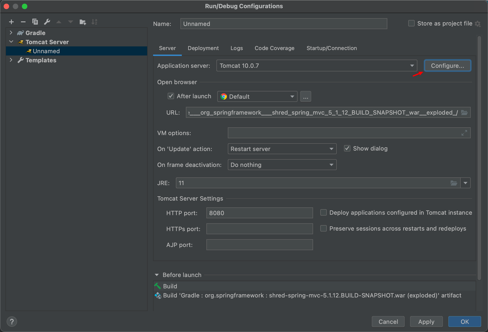

homebrew

- Homebrew安装的软件会默认在`/usr/local/Cellar/`路径下
- 


### unrar

```bash
brew install unrar  

unrar x 需解压的文件目录
```

### MySQL

```bash
# 1、执行安装命令
brew install mysql

# 2、安装完后启动mysql
mysql.server start

# 3、执行安全设置
mysql_secure_installation

# 登录mysql
mysql -u root -p
```


### Redis

- redis的配置文件`redis.conf`存放在`/usr/local/etc`路径下

```bash
brew install redis


####log
To have launchd start redis now and restart at login:
  brew services start redis
Or, if you don't want/need a background service you can just run:
  redis-server /usr/local/etc/redis.conf
```

#### 启动redis服务

```bash
//方式一：使用brew帮助我们启动软件
brew services start redis
//方式二
redis-server /usr/local/etc/redis.conf

1234
//执行以下命令
  redis-server
```

#### 查看redis服务进程

我们可以通过下面命令查看redis是否正在运行

```java
ps axu | grep redis
  
```

#### redis-cli连接redis服务

redis默认端口号**6379**，默认**auth**为空，输入以下命令即可连接

```
redis-cli -h 127.0.0.1 -p 6379
```

#### 启动 redis 客户端，打开终端并输入命令 **redis-cli**。该命令会连接本地的 redis 服务。

```java
$redis-cli
redis 127.0.0.1:6379>
redis 127.0.0.1:6379> PING
PONG
```

在以上实例中我们连接到本地的 redis 服务并执行 PING 命令，该命令用于检测 redis 服务是否启动。

#### 8、关闭redis服务

- 正确停止Redis的方式应该是向Redis发送SHUTDOWN命令

redis-cli shutdown

- 强行终止redis

sudo pkill redis-server

#### 9、redis.conf 配置文件详解

redis默认是前台启动，如果我们想以守护进程的方式运行（后台运行），可以在redis.conf中将daemonize no,修改成yes即可。


### ECS

[i-7xvil6jnrqxjymajyram>](http://ecs.console.aliyun.com/#/server/region/cn-guangzhou?instanceIds=i-7xvil6jnrqxjymajyram)

Vnc 密码 Fqx x x x

ip 8.134.115.230

#### 设置相互信任


#### 安装mysql

密码为kaikeba

```bash
# 安装软件
apt update
# 安装mysql
apt install mysql-server mysql-common mysql-client
# 进入mysql
mysql

#更改mysql root账户认证模式
mysql
select user, plugin from mysql.user;
update mysql.user set authentication_string=PASSWORD('密码'), plugin='mysql_native_password' where user='root';
flush privileges;
exit

#配置root远程登陆
mysql
grant all on *.* to root@'%' identified by '密码' with grant option;
flush privileges;
exit


#修改侦听地址127.0.0.1为0.0.0.0
vi /etc/mysql/mysql.conf.d/mysqld.cnf
bind-address = 0.0.0.0

# 重启mysql
service mysql restart 
```

#### 本地连接远程mysql

```bash

mysql -h 8.134.115.230 -u root -pkaikeba
```

### docker

```bash
sudo add-apt-repository \
"deb [arch=amd64] https://mirror.tuna.tsinghua.edu.cn/help/ubuntu \ $(lsb_release -cs) \
stable"
```

### gradle

#### Step 1. [Download](https://gradle.org/releases) the latest Gradle distribution

#### Step 2. Unpack the distribution

Unzip the distribution zip file in the directory of your choosing, e.g.:

```bash
$ mkdir /opt/gradle
$ unzip -d /opt/gradle gradle-7.1.1-bin.zip
$ ls /opt/gradle/gradle-7.1.1
LICENSE  NOTICE  bin  getting-started.html  init.d  lib  media
```

#### Step 3. Configure your system environment

Configure your `PATH` environment variable to include the `bin` directory of the unzipped distribution, e.g.:

- 方式1：编辑 ~/.bash_profile 将以下内容添加到末尾

```
export GRADLE_7_HOME=/opt/gradle/gradle-7.1.1
alias gradle7='export GRADLE_HOME=$GRADLE_7_HOME'

export PATH=$PATH:$GRADLE_7_HOME/bin

```

执行source ~/.bash_profile使配置生效。

- 方式2:

```
 $ export PATH=$PATH:/opt/gradle/gradle-7.1.1/bin
```


## tomcat



==> Summary
🍺  /usr/local/Cellar/tomcat/10.0.7: 635 files, 15.1MB
==> Caveats
==> tomcat
To have launchd start tomcat now and restart at login:
  brew services start tomcat
Or, if you don't want/need a background service you can just run:
  catalina run

### 使用homebrew安装Tomcat

```
brew search tomcat
brew install tomcat
```

或者指定版本号

Tomcat8

```
brew install tomcat@8

tomcat@8 is keg-only, which means it was not symlinked into /usr/local,
because this is an alternate version of another formula.

If you need to have tomcat@8 first in your PATH, run:
  echo 'export PATH="/usr/local/opt/tomcat@8/bin:$PATH"' >> ~/.zshrc


To have launchd start tomcat@8 now and restart at login:
  brew services start tomcat@8
Or, if you don't want/need a background service you can just run:
  catalina run
==> Summary
🍺  /usr/local/Cellar/tomcat@8/8.5.68:
```

安装目录在： /usr/local/Cellar/tomcat/

### 运行Tomcat

```
catalina run
```

或者以服务方式自启动

```
brew services start tomcat
```

启动完成后可以通过[http://localhost:8080](https://link.jianshu.com?t=http%3A%2F%2Flocalhost%3A8080)访问页面说明启动成功

### manager页面访问

如果要访问[http://localhost:8080/manager](https://link.jianshu.com?t=http%3A%2F%2Flocalhost%3A8080%2Fmanager)的内容，需要编辑以下文件添加用户，不添加或添加不正确会出现401以及403错误

```
403 Access Denied
You are not authorized to view this page.
/usr/local/Cellar/tomcat/9.0.7/libexec/conf/tomcat-users.xml
    <role rolename="admin"/>
    <role rolename="admin-gui"/>
    <role rolename="manager"/>
    <role rolename="manager-gui"/>
    <user username="name" password="pwd" roles="admin,admin-gui,manager,manager-gui"/>
```

保存重启Tomcat后应该就能登陆显示manager页面了，如果还不行

再尝试修改一下 `/usr/local/Cellar/tomcat/9.0.7/libexec/webapps/manager/META-INF/context.xml`

```
<Context antiResourceLocking="false" privileged="true" >
<!--注释下面内容以从允许从Tomcat安装地以外的地址访问-->
  <!-- <Valve className="org.apache.catalina.valves.RemoteAddrValve"
         allow="127\.\d+\.\d+\.\d+|::1|0:0:0:0:0:0:0:1" /> -->
  <Manager sessionAttributeValueClassNameFilter="java\.lang\.(?:Boolean|Integer|Long|Number|String)|org\.apache\.catalina\.filters\.CsrfPreventionFilter\$LruCache(?:\$1)?|java\.util\.(?:Linked)?HashMap"/>
</Context>
```

这样就能在局域网中通过ip访问Tomcat的manager了。


## maven

brew install maven

==> Pouring maven--3.8.1.big_sur.bottle.tar.gz
🍺  /usr/local/Cellar/maven/3.8.1: 87 files, 10.8MB
==> `brew cleanup` has not been run in 30 days, running now...
Removing: /Users/shred/Library/Caches/Homebrew/bat--0.18.0... (2.4MB)
Removing: /usr/local/Cellar/openssl@1.1/1.1.1g... (8,059 files, 18MB)
Removing: /usr/local/Cellar/protobuf/3.13.0... (266 files, 19.8MB)
Removing: /Users/shred/Library/Logs/Homebrew/openjdk@11... (64B)


## nginx

```
==> Installing dependencies for nginx: pcre
==> Installing nginx dependency: pcre
==> Pouring pcre--8.45.big_sur.bottle.tar.gz
🍺  /usr/local/Cellar/pcre/8.45: 204 files, 5.8MB
==> Installing nginx
==> Pouring nginx--1.21.3.big_sur.bottle.tar.gz
==> Caveats
Docroot is: /usr/local/var/www

The default port has been set in /usr/local/etc/nginx/nginx.conf to 8080 so that
nginx can run without sudo.

nginx will load all files in /usr/local/etc/nginx/servers/.

To start nginx:
  brew services start nginx
Or, if you don't want/need a background service you can just run:
  /usr/local/opt/nginx/bin/nginx -g 'daemon off;'
==> Summary
🍺  /usr/local/Cellar/nginx/1.21.3: 26 files, 2.2MB
==> Caveats
==> nginx
Docroot is: /usr/local/var/www

The default port has been set in /usr/local/etc/nginx/nginx.conf to 8080 so that
nginx can run without sudo.

nginx will load all files in /usr/local/etc/nginx/servers/.

To start nginx:
  brew services start nginx
Or, if you don't want/need a background service you can just run:
  /usr/local/opt/nginx/bin/nginx -g 'daemon off;'
```

