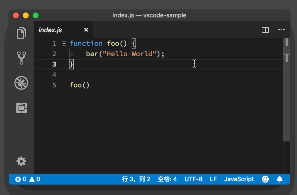
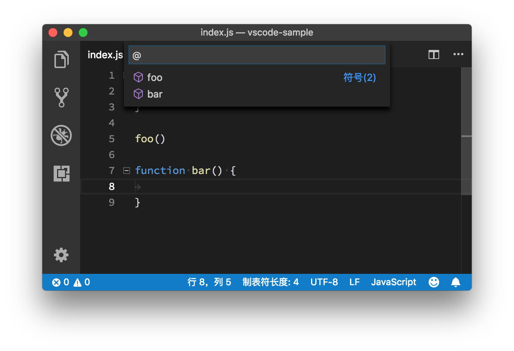
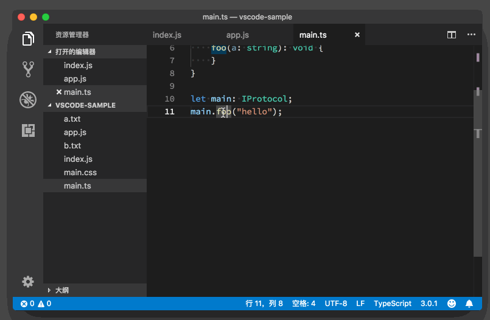
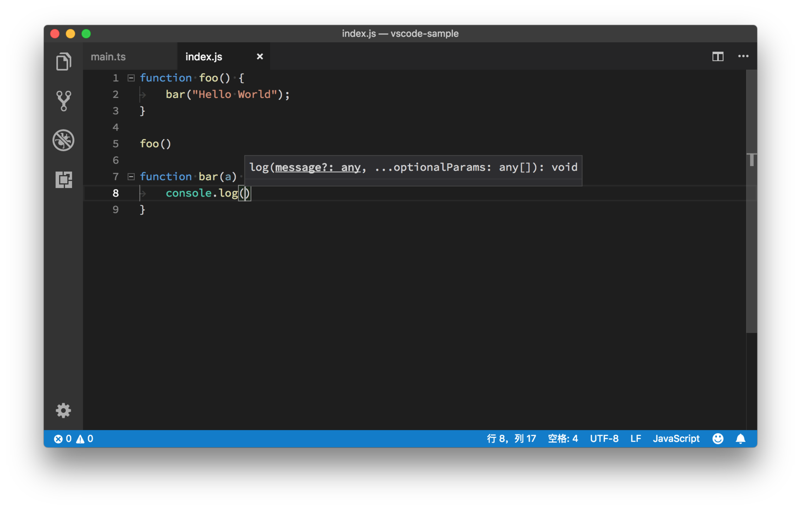

# 配置

```CONF
# 是否在编辑器输入时自动重命名。标签重命名
"editor.renameOnType": false
```


# 常用快捷键

- 移动行代码 alt + ↑/↓
- focus editor 聚焦到编辑器 ctrl + 1
- focus terminal 聚焦到终端 alt + f12
- 切换终端 alt + ←/→
- 在终端和编辑器切换 Ctrl + `

### 选中内容

| id                               | 快捷键      |
| -------------------------------- | ----------- |
| editor.action.smartSelect.expand | shift alt → |


## 分屏

ctrl + \ 分屏

ctrl + w 关闭当前屏幕


ctrl + alt + \ 合并分屏(我自己设置的)
ctrl + shift + alt + \ 合并所有分屏(我自己设置的)
shift + alt + 3 三列编辑器布局(我自己设置的)
ctrl + 1 2 3切换分屏


Mac上分屏快捷是 command +


#  03 

1. 命令面板
    首先来看命令面板，它是 VS Code 快捷键的主要交互界面，你可以通过 F1 或者“Cmd+Shift+P
    ”(Windows 上是 “Ctrl+Shift+P”) 打开。这里提醒一下，如无特殊说明，我在这个专栏里默认基
    于macOS平台进行讲解，但也会本着为你提供方便的原则，同时给出Windows或Linux平台下的操作说
    明。通过编辑器来实现高效编程的思路是一致的，这和具体的使用平台无关，所以你大可不必为此担
    心。
2. 界面概览
    第二个是界面概览，它展示了 VS Code 默认界面里的不同部件的位置、名称和快捷键。VS Code 强调
    无鼠标操作，但是对于初学者而言快捷键的记忆是个麻烦，这个界面恰好可以帮助你渡过最初的不适应
    阶段


3. 交互式演习场
第三个是交互式演习场，打开这个界面，你会看到一个全英文的初学者教程，其中通过各种交互示例给
出了 VS Code 的核心功能，展示了一些高级代码编辑功能的使用，每个功能都会有一个代码片段和编
辑器供你实时使用。


命令行的使用 

如果你是 Windows用户，安装并重启系统后，你就可以在命令行中使用 code 或者 codeinsiders
了，如果你希望立刻而不是等待重启后使用，可以将 VS Code 的安装目录添加到系统环境
变量 PATH中， Windows 64 位下的 VS Code 安装路径是 C:\Program FIles\Microsoft VS
Code下。
如果你是在 macOS 上使用，安装后打开命令面板，搜索Shell 命令：在 PATH 中安装 “Code” 命
令并执行，然后重启终端模拟就可以了。


- 如果你希望使用已经打开的窗口来打开文件，可以在 `code` 命令后添加参数 `-r`来进行窗口的复用。


- 使用参数 `-g <fle:line[:character]>` 打开文件，然后滚动到文件中某个特定的行和列，比如输入 `code -r -g package.json:128`命令，你就可以打开 package.json 这个文件，然后自动跳转到 128 行。

- 比较两个文件的内容，你只需使用 -d参数，并传入两个文件路径，比如输入
  `code -r -d a.txt b.txt`命令，就可以比较a.txt和b.txt两个文件的内容了。有了这个命令，你就可
  以既使用命令行运行脚本，也可以借助 VS Code 的图形化界面进行文件内容的对比了。

- VS Code 命令行除了支持打开磁盘上的文件以外，也接受来自管道中的数据。这样你就可以将原本在命令行中展示的内容，实时地展示在 VS Code 里，然后在编辑器中搜索和修改。比如，你可以把当前目录下所有的文件名都展示在编辑器里，此时只需使用`ls | code -`命令。


- VS Code 的命令行的各个参数，其实能够定制 VS Code 是怎样
  运行的，比如--disable-extensions、--max-memory，它们都有特殊的应用场景。当然，如果
  你发现了哪个配置是你特别希望默认就打开的，那么你可以在 shell 环境里创建一个别名 (alias)，而不
  用局限于 code 这个命令。


# 04

### 光标移动

- 对于**代码块的光标移动**。很多编程语言都使用花括号将代码块包裹起来，比如
  if、for 语句等，你很可能会希望通过一个快捷键，就能实现在**代码块的始末快速跳转**。只需按下 `Cmd + Shift + \`（Windows 上是 `Ctrl + Shift + \`），就可以在这对花括号之间跳转。

- 光标操作就是**移动到文档的第一行或者最后一行**，你只需按下 `Cmd 和上下方`
  `向键`即可（Windows 上是 `Ctrl + Home/End` 键）。


### 文本选择

对于代码块的文本选择， VS Code 默认没有绑定快捷键。那么，是不是就没办法了呢？
当然不是。你可以先使用命令面板找到命令 **“选择括号所有内容” （select to backet）**并运行。后


### 删除操作

- 想把当前行中光标之前的文本全部删除，就可以先选中这段文本（Windows/Linux:
  Home + Shift，macOS: Cmd + Left + Shift )，然后再按删除键
- 按下 Cmd 和 Delete 键则是删除当前行中光标前（左侧）的所有内容（Windows 上未绑
  定快捷键，可以打开命令面板运行“**删除左侧所有内容 select all left**”）。

总结一下：
一、行内操作快捷键可以拆分出三个维度来理解
1、操作内容：移动（无），选择（⇧），删除（⌫）
2、操作方向：移动和选择都是左右方向键（→、←），删除的方向键（⌫、 fn⌫）
3、操作范围：单字符（无），单词（⌥），行（⌘）
因此，针对行内的操作的快捷键从以上三个维度进行组合即可。
二、跨行操作
操作范围：代码块（⌘⇧），html标签块（不支持），文档（⌘）
代码块的移动 ⌘⇧\
代码块的选择 ⌘⇧] （需要自定义）
代码块的删除 目前看来只能先选择，在⌫删除
文档的移动 ⌘↑ ⌘↓
文档的选择 ⌘⇧↑ ⌘⇧↓
文档的选择 目前看来只能先选择，在⌫删除

### 自定义快捷键

首先你可以打开命令面板（你还记得它的快捷键不？），搜索**“打开键盘快捷方式 keyboard shortcuts”**然后执
行，这时你将看到相对应的界面。


# 05

编程语言相关的命令

2. 代码格式化
    我们平常在做自己的小项目或者随便写一些脚本的时候，可能不会太在意代码的格式。不过一旦开始团
    队合作，整个项目组则会选择同一个代码风格和格式以有效降低协同成本。所以定期对自己写的代码进
    行格式化是个很好的习惯。
    你可以按下 “`Option + Shift + F`” （Windows 上是 `Alt + Shift + F`）来对整个文档进行格式化，VS
    Code 也会根据你当前的语言，选择相关的插件。当然，前提条件是你已经安装了相关插件。

你也可以选中一段代码，然后按下 “Cmd + K Cmd + F” （Windows 上是 Ctrl + K Ctrl + F），这样只有这段被选中的代码才会被格式化。

3. 代码缩进
有的时候，你会觉得代码格式化太重了，需要的可能只是把代码里的缩进调整一下。这时你可以打开命
令面板（快捷键“Cmd + Shift + P”），搜索 “缩进”，然后使用 “重新缩进行 `Reindent Lines`” 将整个文档的缩进进行调
整，但更多时候，你只需要运行 “重新缩进选中行” 来调整部分选中代码行的缩进。


**第一个是调换字符的位置**。你可以按下 “Ctrl + t” （Windows 上未绑定快捷键，可以打开命令面板，搜索 ”转置游标处的字符`Transpose characters around the cursor`“） 来把当前光标前后的字符调换位置。

**第二个是调整字符的大小写**，我估计这个你会经常用到。你可以选中一串字符，然后在命令面板里运行“转换为大写”或 “转换为小写”, 来变换字符的大小写。

**第三个是合并代码行**。有的时候你可能会为了避免代码看起来过于冗余，就会把比较短小的几行代码合并到一行里面去。这时，你只需要按下 “ Ctrl + j ” （Windows 上未绑定快捷键，可以打开命令面板，搜索 ”合并行 `Join Lines`“）就可以了，而不需要不断地调整光标、删除换行符。

**第四个是行排序**。无论是你在写代码，还是写 Markdown，你都可以把代码行按照字母序进行重新排序。不过这个命令比较小众，VS Code 并没有给这个命令指定快捷键，你可以调出命令面板，然后搜索 “按升序排列行 `sorting lines ascending`” 或者 “按降序排列行” 命令执行。

### 撤销光标的移动和选择

**第五个是撤销光标的移动和选择**。有的时候你移动完光标之后，又希望把光标回退到上一个位置，这时你只需按下 “Cmd + U”（Windows 上是 “`Ctrl + U`”），就可以撤销这一次光标的移动。


# 06 多光标

### 1. 使用鼠标

第一种添加多光标的方式，就是使用鼠标。在键盘上按住 “Option”（Windows 上是 Alt），然后鼠标点在第二个“5”之前，那么第二个光标就创建好了。现在你可以看到两个光标，第二个光标比第一个要细一点。

### 2. 使用键盘

第二种方式是使用键盘，但是比第一种方式要多两个步骤，我们来一起看看是为什么。

首先你还是先移动光标到第一个“5”的前面。然后按下 “Cmd + Option + 下方向键”（Windows 上是 “Ctrl + Alt + 下方向键”），在当前光标的下面创建一个光标。


## 创建多光标的两个特别命令

接下来，我再给你介绍两个关于多光标的创建的特别方法，如果你还没有消化上面的内容，也先别急，等把后面的全部看完之后再回去练习。

### 1. “Cmd + D”

首先讲第一种，还是上面的代码，你把光标移动到数字“5”之前，按下 “Cmd + D”，这样第一个“5”就被选中了；然后再按一次 “Cmd + D”（Windows 上是 Ctrl + D），你可以看到，第二个“5”也被选中了。

“`Cmd + D`” 这个命令的作用是，第一次按下时，它会选中光标附近的单词；第二次按下时，它会找到这个单词第二次出现的位置，创建一个新的光标，并且选中它。这样只需要按下三次，你就选中了所有的“5”。这个时候你再按下 “右方向键”，输入“px”，即可完成任务。

它的适用情况比较特别：处理多次出现的“相同”单词。

### 2. Option + Shift + i

接下来讲讲第二种，是跟代码行批量处理有关，也还是用的前面的代码。首先你选择多行代码，然后按下 “Option + Shift + i” （Windows 上是 Alt + Shift + i），这样操作的结果是：每一行的最后都会创建一个新的光标。


# 07 文件跳转

## 文件跳转

VS Code 在命令面板里提供了一种支持搜索的文件跳转方式。当你按下 “`Cmd + P`” （Windows 上是 `Ctrl + P`）时，就会跳出一个最近打开文件的列表，同时在列表的顶部还有一个搜索框。	

当你找到目标文件后，可以按下 “`Cmd + Enter` ” （Windows 上是 `Ctrl + Enter`）组合键。你会发现与上面不一样的是，这个文件在一个新的编辑器窗口中打开了（关于编辑器窗口的管理，我会在之后的章节里介绍）。


## 行跳转

打开某一个文件之后，你的另外一个需求可能就是要快速跳转到这个文件的某一行。你可能会想，VS Code是不是可以像Vim那样，输入“:13”就能跳转到第13行。是的，VS Code也提供了一种极为简单的方式来支持行跳转，你只需要按下 “`Ctrl + g`”，紧接着编辑器就会出现一个输入框。如下图所示：

你会惊喜地发现，这个输入框的第一个字符就是 “:”，在这之后输入数字，你就能够将光标快速地移动到那一行。

高阶组合技巧。如果你想跳转到某个文件的某一行，你只需要先按下 “Cmd + P”，输入文件名，然后在这之后加上 “:”和指定行号即可。




## 符号 (Symbols) 跳转

文件跳转和行跳转，是代码跳转的基本操作，也是日常编码中的高频操作。不过有的时候，你可能会希望能够立刻跳转到文件里的类定义，或者函数定义的位置。为了支持这种跳转，VS Code 提供了一套 API 给语言服务插件，它们可以分析代码，告诉 VS Code 项目或者文件里有哪些类、哪些函数或者标识符（我们把这些统称为符号）。

如果要在一个文件里的符号之间跳转，你只需按下 “`Cmd + Shift + O`” （Windows 上是 `Ctrl + Shift + O`），就能够看到当前文件里的所有符号。`workbentch.action.gotoSymbol`



请注意，在按下 “`Cmd + Shift +O`”后，输入框里有一个 “`@`”符号，这个符号在这里的意义，我会在后面的章节里去介绍，你可以先留个心眼。这时，如果你输入 “`:`”，就可以将当前文件的所有符号，进行分类，这样搜索符号也就更加方便。


有些语言除了提供单个文件里的符号，还支持在多个文件里进行符号跳转。比如在 VS Code 里，如果你打开了多个 JavaScript 文件，就可以按下 “`Cmd + T`” （Windows 上是 `Ctrl + T`），搜索这些文件里的符号。


## 定义 (Definition) 和实现 (implementation) 跳转

符号跳转依托于语言插件对代码的分析，已经算得上具备一定的智能特性，但是它还是不够精确。比如说我们看到某个函数的调用，想要知道这个函数的接口定义是什么样的，它的实现细节是什么样的，光靠符号跳转，还是会不方便。我们需要的是直接跳转到定义和实现的位置，Java程序员看到这里一定会深有感触。

当然，这个功能也需要语言本身的支持。比如说当你在使用 TypeScript 时，按下 `F12`，就可以**跳转到函数的定义处**。

也可以按下 “`Cmd + F12`” （Windows 上是 `Ctrl + F12`），**跳转到函数的实现的位置**。

## 引用 (Reference) 跳转

很多时候，除了要知道一个函数或者类的定义和实现以外，你可能还希望知道它们被谁引用了，以及在哪里被引用了。这时你只需要将光标移动到函数或者类上面，然后按下 “`Shift + F12`”，VS Code 就会打开一个引用列表和一个内嵌的编辑器。在这个引用列表里，你选中某个引用，VS Code 就会把这个引用附近的代码展示在这个内嵌的编辑器里。




# 08 鼠标

**拖放功能（drag and drop）**。

比如在今天的示例代码中，我们选中 `bar` 这个函数，然后将鼠标移到这段选中的代码之上，按下鼠标左键不松开。这时你可以看到，鼠标指针已经从一条竖线，变成了一个箭头。这时候我们移动鼠标的话，就可以把这段文本拖拽到我们想要的位置。

如果我们在拖拽这段文本的同时，按下 Option 键（Windows 上是 Ctrl 键），鼠标指针上会多一个加号，这时候我们再移动鼠标或虚拟光标至我们想要的位置，然后当我们松开鼠标左键的时候，这段文本将会被复制粘贴到虚拟光标所在的位置，也就是我们既定的目标位置。


## 多光标

在前面第6篇文章中，我们已经学习了如何使用鼠标添加多光标。不得不承认，在鼠标的帮助下，多光标的创建显得格外便捷。我们只需按下 Option 键，然后在需要创建新光标的地方，按下鼠标左键即可。简言之，就是按住 Option 键，然后哪里需要点哪里。

不过，VS Code 中还有一个更加便捷的鼠标创建多光标的方式。当然，这首先要求你的鼠标拥有中键。你只需按下鼠标中键，然后对着一段文档拖出一个框，在这个框中的代码就都被选中了，而且每一行被选中的代码，都拥有一个独立的光标。


## 悬停提示窗口

如果我们把鼠标移动到 `foo` 上面时，按下 Cmd 键（Windows 上是 Ctrl），则能够在悬停提示窗口里直接看到 `foo`的实现。

我们能看到这样的信息，是因为这个功能也被包含在了 VS Code 的语言接口之中。VS Code 会告诉语言服务，当前鼠标所在位置的信息，语言服务会根据当前的项目情况和代码提供有用的信息。

在 JavaScript 或者 Java 这样的编程语言中，当我们把鼠标移动到某个变量上时，我们能够看到这个变量的定义信息。而在 CSS 中，当我们把鼠标移动到一个 CSS 规则上时，我们能看到的则是一段能够让这个 CSS 规则生效的 HTML 的样例代码。


# 09、

## 预览窗口 `Ctrl+空格键`

除了使用鼠标键外，我们还可以使用 “Ctrl+空格键”组合键来快速调出这个快速预览窗口。

### 参数预览 `Cmd + Shift + Space`

最后，当我们从建议列表选择了一个函数，然后输入括号，准备开始输入参数时，我们会看到一个参数预览的悬浮框。通过这个参数预览的窗口，我们可以知道这个函数可以传入哪些参数，它们的参数类型又是什么样的。如下图所示：



同样的，隐藏这个窗口的快捷键也是 Escape。如果你想再次将其调出的话，需要按下 “Cmd + Shift + Space” （Windows 上是 Ctrl + Shift + Space）。

## 自动补全

VS Code 当中的自动补全内容，其实是由语言服务来提供的。我们在 “VS Code 的Why、How 和 What”文章里介绍过，VS Code 为编程语言工作者提供了统一的 API ，即 Language Server Protocol，每种语言都能够通过实现这个 API 在 VS Code 上得到类似 IDE 的开发体验，而各个语言根据这个 API 实现的服务，就被称为**语言服务**。

如果我们偶尔觉得这个自动补全窗口是多余的，希望暂时不看到它，可以按下 Escape 键将其隐藏。后续如果希望再次看到这个窗口，除了通过打字来将其调出以外，我们还可以按下 “`Ctrl + 空格键`”来**手动地调出建议列表**。 `editor.action.triggerSuggest`


## 左边的灯泡

在这个例子里，我们要做的就是选择第一个操作建议，把`pading`换成 `padding`。除了点击这个黄色的灯泡图标，我们也可以按下 “Cmd+.” （Windows 上是 Ctrl + . ）来调出这个快速修复的建议列表。


## 重构

重构这个功能，相信你已经在频繁地使用了。

当我们想修改一个函数或者变量的名字时候，我们只需把光标放到函数或者变量名上，然后按下 F2，这样这个函数或者变量出现的地方就都会被修改。

## 基于单词的自动补全

上面提到的几个功能，它们都依托于语言服务来提供内容。但是有的时候，语言服务并不完美。编辑器于是提供了一种相对 “笨” 一些的提示，那就是基于单词的提示。编辑器通过分析当前的文件里的内容，进行简单的正则表达式匹配，给我们建议已经出现过的单词。

## 关闭单词自动补全

当然，如果你觉得语言服务的提示已经足够好了，不需要这么暴力、这么笨的文本提示，那你也可以通过设置 “editor.wordBasedSuggestions” 将其关闭。

